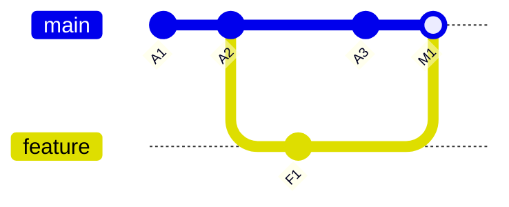

# 01 基本概念与工作原理

## 1.1 为什么需要版本控制？

- 记录变更历史，支持回退
- 团队协作并行开发
- 审核与发布可追溯

## 1.2 Git 与集中式 SVN 的区别

- Git：**分布式**，每个人都有完整仓库；离线也能提交
- SVN：**集中式**，必须连中央服务器

## 1.3 三大区域与文件状态

```cmd
工作区 (Working Directory) → 暂存区 (Staging Area) → 本地仓库 (Repository)
```

文件状态：`untracked` → `modified` → `staged` → `committed`


## 1.4 提交对象与快照

- Git 不是只存“差异”，而是按提交点存 **快照**（引用相同内容的对象避免重复）。

## 1.5 HEAD、分支与指针

- `HEAD` 指向当前分支，分支再指向某个提交。



---

## 实验：用空目录理解暂存与提交

- 新建目录并初始化

```powershell
mkdir demo01
cd demo01
git init
```

- 创建文件并观察状态

```powershell
'hello' > a.txt
git status
git add a.txt
git status
git commit -m "feat: add a.txt"
git log --oneline
```

### 练习题

1. 说出工作区/暂存区/仓库区的作用与流转关系。
2. 解释“Git 以快照为核心”的含义。
3. `HEAD`、`分支` 与 `提交` 的关系是什么？
