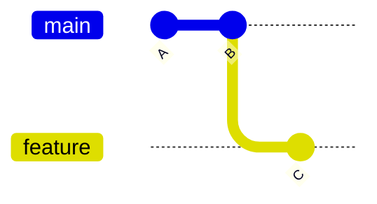

# 02 基本概念与工作原理

## 2.1 为什么需要版本控制

如果只用 `project-final`、`project-final-v2` 复制文件夹保存版本，很难回答以下问题：

- 哪些文件发生了变化，为什么修改？
- 某个错误从哪个版本开始出现？
- 两个人同时修改后，怎样合并双方成果？
- 线上版本对应哪一次代码状态？

Git 用一系列提交记录项目历史。每次提交都包含项目快照、作者、时间、说明和父提交，因此可以比较版本、恢复内容并审查变更。

Git 是分布式版本控制系统：克隆仓库后，本地通常拥有完整的提交历史，可以离线查看历史、创建分支和提交。GitHub、GitLab 是托管 Git 仓库并提供 Pull Request、权限和 CI 等协作能力的平台，它们不是 Git 本身。

## 2.2 四个位置

日常使用 Git 时，要区分四个位置：

| 位置 | 英文 | 作用 |
|---|---|---|
| 工作区 | Working tree | 实际编辑的文件 |
| 暂存区 | Index / Staging area | 选择下一次提交包含哪些内容 |
| 本地仓库 | Local repository | `.git` 中保存的提交、分支和对象 |
| 远程仓库 | Remote repository | 团队共享的仓库，例如 GitHub 或 GitLab |


`git add` 不是“上传”，`git commit` 也不是“推送”。提交只进入本地仓库，执行 `git push` 后才会发送到远程仓库。

## 2.3 文件状态

Git 首先区分文件是否被跟踪：

- `untracked`：Git 尚未跟踪的新文件
- `tracked`：已经进入过暂存区或提交的文件

已跟踪文件又可能处于：

- `unchanged`：与当前提交一致
- `modified`：工作区内容已修改，但尚未完整暂存
- `staged`：暂存区已经记录下一次提交要使用的内容

新文件通常经历：

```text
untracked -> staged -> committed
```

已提交文件再次修改时通常经历：

```text
unchanged -> modified -> staged -> committed
```

同一个文件可以同时有“已暂存修改”和“未暂存修改”。因此提交前要分别执行 `git diff` 与 `git diff --staged`。

## 2.4 提交、分支和 HEAD

提交（commit）是项目在某个时间点的快照。每个提交都有唯一对象 ID，通常显示为一段较短的十六进制字符。

分支是指向某个提交的可移动指针。创建新提交后，当前分支会向前移动。`HEAD` 通常指向当前分支，因此也表示“当前检出的版本位置”。



上图中，`main` 指向 B，`feature` 指向 C。切换分支时，Git 会调整工作区，使其匹配目标分支指向的提交。

## 2.5 如何指定一个版本

Git 命令经常需要指定某个提交，这类参数统称 revision（版本引用）。

| 写法 | 含义 |
|---|---|
| `HEAD` | 当前检出的提交 |
| `HEAD~1` | 当前提交沿第一父提交向前一代，常写作“上一个提交” |
| `HEAD~3` | 沿第一父提交连续向前三代 |
| `<commit-id>` | 用提交 ID 指定版本，例如 `a1b2c3d` |
| `main` | 用分支名指定该分支当前指向的提交 |
| `v1.0.0` | 用标签名指定标签指向的提交 |

例如查看上一个提交：

```powershell
git show HEAD~1
```

命令中的独立 `--` 常用于分隔“版本或选项”和“文件路径”。例如：

```powershell
git diff HEAD~1 -- README.md
```

这表示只查看 `README.md` 相对于上一个提交的变化，也能避免文件名与分支名相同时产生歧义。

## 2.6 实验：观察文件状态

**环境与范围：** Windows PowerShell；在新建的 `git-basic-lab` 目录中执行。删除该练习目录即可清理，不要在已有项目中运行。

先确认已安装 Git：

```powershell
git --version
```

如果提示找不到命令，请先完成[第 01 章](01_install_and_config.md)。然后创建独立练习仓库，并只为该仓库设置练习身份：

```powershell
New-Item -ItemType Directory git-basic-lab
Set-Location git-basic-lab
git init -b main
git config user.name "Git Learner"
git config user.email "learner@example.com"
git status
```

创建文件并观察状态变化：

```powershell
Set-Content -Path hello.txt -Value "hello"
git status --short
git add hello.txt
git status --short
git commit -m "docs: add hello text"
git log --oneline
```

典型的简短状态如下：

```text
?? hello.txt
A  hello.txt
```

`??` 表示未跟踪，`A` 表示已加入暂存区。提交成功后，`git status` 应显示工作区干净。

再次修改文件，并在暂存后继续修改：

```powershell
Add-Content -Path hello.txt -Value "staged line"
git add hello.txt
Add-Content -Path hello.txt -Value "working tree line"
git status
git diff
git diff --staged
```

此时同一个文件会同时出现在“Changes to be committed”和“Changes not staged for commit”中。前者是已经进入暂存区的修改，后者是暂存后继续产生的工作区修改。

## 2.7 常见错误

- 在错误目录执行 `git init`：先用 `Get-Location` 确认位置；误初始化且尚未产生有价值提交时，再谨慎删除该目录下的 `.git`。
- 把提交理解成上传：使用 `git remote -v` 检查是否配置远程，使用 `git push` 才会发送提交。
- 直接删除 `.git`：这会删除本地提交、分支和配置，不应作为普通撤销方法。

```text
fatal: not a git repository (or any of the parent directories): .git
```

这表示当前目录及其父目录中没有 Git 仓库。先用 `Get-Location` 和 `Get-ChildItem -Force` 检查位置，不要在不确定的目录再次执行 `git init`。

## 2.8 本章总结

- Git 的核心是提交历史，不是文件夹副本。
- 工作区负责编辑，暂存区负责选择，本地仓库负责保存提交，远程仓库负责共享。
- 分支指向提交，`HEAD` 通常指向当前分支。
- `git status`、`git diff` 和 `git diff --staged` 是判断当前状态的基础工具。

## 练习

1. 创建 `notes.txt`，分别观察未跟踪、已暂存和已提交状态。
2. 暂存一次修改后继续编辑同一文件，说明两个 `git diff` 的结果为何不同。
3. 用自己的话解释 `git add`、`git commit`、`git push` 分别把内容送到哪里。

### 自检提示

- 新文件未暂存时，`git status --short` 应显示 `??`。
- 同一文件暂存后又修改，简短状态应显示 `MM`。
- `git show HEAD~1` 应显示当前提交的父提交；仓库只有一个提交时，该引用不存在。

[上一章：安装与初始配置](01_install_and_config.md) · [下一章：基本命令与日常提交](03_common_commands.md)
