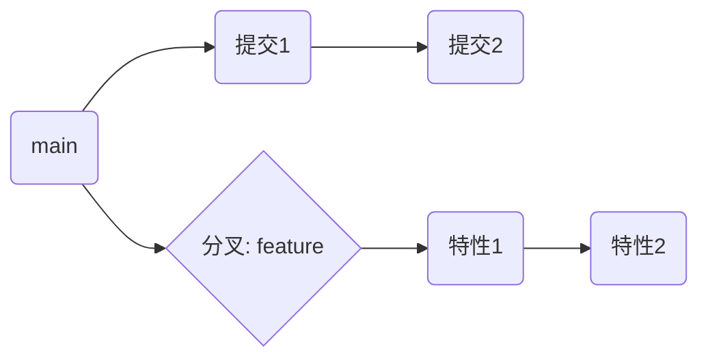

# 04 分支与合并（含冲突解决）

## 4.1 创建与切换

```powershell
git branch           # 查看
git branch feature/login
git switch feature/login   # 或 git checkout feature/login
```

## 4.2 合并（merge）与变基（rebase）

- `merge`：保留分叉历史，产生合并提交（非快进时）
- `rebase`：把你的提交“挪到”目标分支后面，历史更线性



## 4.3 冲突解决步骤

1) 执行 `git merge <branch>` 或 `git rebase <branch>`  
2) Git 标记冲突文件：`<<<<<<<` `=======` `>>>>>>>`  
3) 手工编辑解决冲突 → `git add <file>`  
4) `git commit`（若是 rebase，`git rebase --continue`）

---

## 实验：制造并解决一次冲突

- 准备

```powershell
mkdir demo04; cd demo04
git init
'line1' > a.txt
git add .; git commit -m "feat: init a.txt"
git switch -c feature
'feature change' >> a.txt
git commit -am "feat: change in feature"
git switch main
'main change' >> a.txt
git commit -am "feat: change in main"
```

- 合并并解决

```powershell
git merge feature
# 编辑 a.txt 解决冲突 → git add a.txt
git commit -m "merge: resolve conflict in a.txt"
git log --oneline --graph --decorate --all
```

