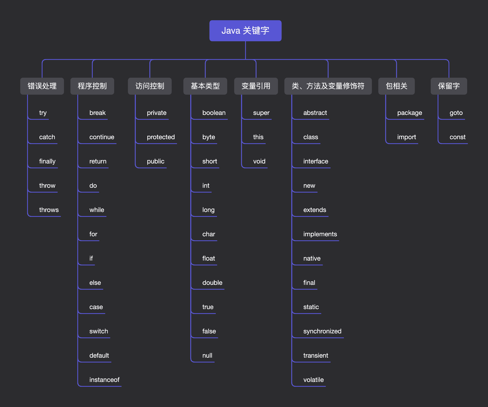

# Java 变量与常量

本期内容预告如下：

- 变量  
- 数据类型  
- 变量作用域
- 常量

本文将主要从以上四个方面出发，带领大家来看一下 **Java 中的变量和数据类型**。

---

## 变量

### 什么是变量？

所谓变量，就是用来命名一个数据的标识符，其定义格式如下：

```java
数据类型 变量名称 = 初始值;
```

- **数据类型**：限制存储数据的形式  
- **变量名称**：变量的符号，就像人的名字  
- **初始值**：变量存储时的初始数据  

在 Java 中，变量主要分为两种：

- 基本类型的变量
- 引用类型的变量

```java
// 基本类型的变量
int id = 1;
// 引用类型的变量
String name = "安信株式会社";
```

---

### 标识符命名规则

标识符命名并不是我们想怎么命名就怎么命名，需要满足一定的规则，最常见的标识符命名规则主要有如下几条：

- **强制**：只能使用字母（大小写）、数字、`$`、`_`  
- **强制**：不能使用 Java 关键字（如 `int`、`for`、`long`）  
- **强制**：第一个字符不能是数字  

---

### 变量的特点

1. 变量必须先声明再使用  
2. 类型一旦确定，不可存储其他类型数据  
3. 定义时可不赋值，但使用前必须赋值  
4. 同一作用域内不可重复定义  
5. 变量的值可被重新赋值  
6. 变量以小驼峰的形式命名(小写字母开头，换单词首字母大写)，例如:`userName, totalCount`

示例：

```java
public class Main {
    public static void main(String[] args) {
        // 定义 int 类型变量 id
        int id = 1;
        System.out.println(id); // 输出 1

        // 重新赋值
        id = 2;
        System.out.println(id); // 输出 2
    }
}
```

---

### 常见关键字

这是一种事先定义好的，有特定意义的标识符，也叫做保留字。对于 Java 编译器有着特殊意义，用来表示一种数据类型，或者表示程序的结构等。

此外，关键字不能用作变量名、方法名、类名、包名和参数名。

常见的关键字可以分为如下几类，具体的关键字如下图所示：

- 访问控制类
- 类、方法及变量修饰符类
- 程序控制类
- 错误处理
- 包相关
- 基本类型
- 变量引用
- 保留字



## 数据类型

### 基本数据类型

Java 中，共有 8 种基本数据类型，由 Java 语言预定好的，每个数据类型都属于关键字  而且每种基本变量都有其对应的封装类，
这 8 种基本数据类型分别是：

- 整型（4 种）
    - 字节型（ byte ）
    - 短整型（ short ）
    - 整型（ int ）
    - 长整型（ long ）
- 浮点型（2 种）
    - 单精度浮点型（ float ）
    - 双精度浮点型（ double ）
- 字符型（1 种）
    - char
- 布尔型（1 种）
    - boolean

下面的表就是 Java 中 8 大数据类型所占的内存空间，对应封装类，数据表示范围以及默认值的一下相关情况。

| 数据类型 | bit | 字节 | 封装类   | 范围/取值                   | 默认值  |
|:------:----|-----|:------:|:------:----|:------::------::------::------:-----|:------:---|
| byte     | 8   | 1    | Byte     | -2⁷ ~ 2⁷-1                  | 0       |
| short    | 16  | 2    | Short    | -2¹⁵ ~ 2¹⁵-1                | 0       |
| char     | 16  | 2    | Character| `\u0000` ~ `\uffff`       | `\u0000`|
| int      | 32  | 4    | Integer  | -2³¹ ~ 2³¹-1                | 0       |
| long     | 64  | 8    | Long     | -2⁶³ ~ 2⁶³-1                | 0L      |
| float    | 32  | 4    | Float    | 1.4e-45 ~ 3.4e38             | 0.0f    |
| double   | 64  | 8    | Double   | 4.9e-324 ~ 1.8e308           | 0.0d    |
| boolean  | 1   | JVM 决定 | Boolean| true / false               | false   |

注意：

1. boolean 一般用 1 bit 来存储，但是具体大小并未规定，JVM 在编译期将 boolean 类型转换为 int，此时 1 代表 true，0 代表 false。  此外，JVM 还指出 boolean 数组，但底层是通过 byte 数组来实现。
2. 使用 long 类型时，需要在后边加上 L/l，否则将其作为整型解析，可能会导致越界。
3. 浮点数如果没有明确指定 float 还是 double，统一按 double 处理。
4. char 是用 单引号 '' 将内容括起来，只能存放一个字符，相当于一个整型值（ASCII 值），能够参加表达式运算；
5. String 是用 双引号 "" 将内容括起来，代表的是一个地址值。
6. Java 在内存中是采用 Unicode 表示，所以无论是一个中文字符还是英文字符，都能用 char 来表示。

### 引用数据类型

|数据类型 |默认值|
|:------:|:------:|
|数组     |`null` |
|类       |`null` |
|接口     |`null` |
|String   |`null` |

**String**
对于引用数据类型中的 String，我们需要特别关注。

String 不同于 char，它属于引用类型，而 char 属于基本数据类型。用双引号 "" 括起来表示字符串，一个字符串能够保存 0 个到任意个字符，它一旦创建就不能被改变。

而针对字符串，如果我们要打印一些特殊的字符，比如字符串本来就包含 "，那么这个时候就需要借助于转义字符 \，最常见的转义字符主要有：

|转义字符|含义|
|:------:|:------:|
|`\"`|字符 `"`|
|`\'`|字符 `'`|
|`\\`|字符 `\`|
|`\n`|`换行符`|
|`\t`|`制表符 Tab`|
|`\r`|`回车符`|

那多个字符串之间或者字符串和其他类型数据之间，该如何进行连接呢？

Java 编译器中，对于字符串和其他数据类型之间，可以使用 + 进行连接，编译器会自动将其他数据类型自动转换为字符串，然后再进行连接；

```java
String str = "安信株式会社";
int year = 10;
String all = str + year;
System.out.println(all);

//输出结果为：安信株式会社10
```

### 数据类型转换

对于基本数据类型，不同类型之间是可以相互转换的，但需要满足一定的条件；

> ***从小到大自动转，从大到小强制转***

- **隐式转换（自动类型转换,从小到大）**

当满足如下条件时，如果将一种类型的数据赋值给另一种数据类型变量时，将执行自动类型转换：

> 1. 两种数据类型彼此兼容；
> 2. 目标数据类型的取值范围大于源数据类型；

一般而言，隐式转换的规则是从低级类型数据转换为高级类型数据，对应规则如下：

> - 数值类型：byte -> short -> int -> long -> float -> double
> - 字符类型转整型：char -> int

- **显式转换（强制类型转换，从大到小）**

那既然满足上述两个条件时会发生隐式转换，那不满足我们又想进行数据类型转换时，我们该怎么办呢？

这个时候就需要我们的 **显式转换** 登场了，其语法格式如下：

```java
(type) variableName;
```

我们举个例子来说下：

```java
int num = 3;
double ans = 5.0;
// 要将 double 类型的值赋值给 int，则需要强制转换
num = (int)ans;
```

**注意：**强制转换可能会导致精度丢失，所以一般情况下尽量能不用就不用。

- **字符与数字转换**

```java
char c = 'A';
int code = c;  // 65
char d = (char)(code + 1); // 'B'
```

---

## 变量作用域

变量的作用域是指**变量自定义的地方起**，可以使用的有效范围。
在程序中不同的地方定义的变量具有不同的作用域。
一般情况下，在本程序块（即以**大括号“{}”括起**的程序段）内定义的变量在本程序块内有效。

```java
public class Var_Area_Example
 {
    static int n_var1=10;   //类变量,对整个类都有效
    public void display()
    {
        int n_var2=200;   //方法变量，只在该方法内有效
        n_var1=n_var1+n_var2;
        System.out.println("n_var1="+n_var1);
        System.out.println("n_var2="+n_var2);
    }
    public static void main(String args[])
    {
        int n_var3;  //方法变量，只在该方法内有效
        n_var3=n_var1*2;
        System.out.println("n_var1="+n_var1);
        System.out.println("n_var3="+n_var3);       
    }
 }
```

---

## 常量

既然有变量，那就有与之相对的常量（也就是值是固定的，不能再变）。

通常我们把 Java 中用 final 关键字所修饰的成员变量叫做常量，它的值一旦给定就无法再进行改变！

- 定义
    - 用 `final` 修饰  
    - 值一旦赋值不可更改

- 命名特点
    -全部大写，换单词用`_`(下划线)分割

```java
final 数据类型 常量名 = 常量初始值;
```

```java
final int num = 1024;
```

```java
public class Main {
    public static final double PI = 3.14; // 静态常量
    final int num = 1024;                 // 成员常量

    public static void main(String[] args) {
        final long count = 1000;          // 局部常量
    }
}
```

---

## 总结

本文主要介绍了：

- Java 中的变量  
- 数据类型（基本 & 引用）  
- 数据类型转换  
- 变量作用域  
- 常量  

这些内容是理解 Java 语法和面向对象之前的重要基础。
