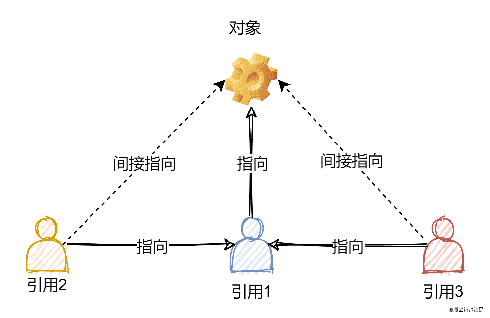

# 类的相关知识

## 前言

今天来看看 **类** 在 Java 中的体现。类是 Java 面向对象编程的核心，涉及属性、方法、构造方法、引用等。

---

## 类与对象

以我们日常生活为例，我们现在很多人都养宠物，而宠物 都有一些共同状态，比如名字、毛色、年龄…… 这样一来我们就可以设计一个叫做类的东西，用来 代表宠物 这一类事物。

```java
public class Pet{
    // 名字
    public String name;

    // 毛色
    public String furColor;

    // 年龄
    public int age;
}
```

有了这个类之后，它就相当于我们的一个模板，根据这个模板我们就能够创建一个个具体的宠物，而这些宠物，就叫做 对象。

```java
public class Pet{
    // 名字
    public String name;

    // 毛色
    public String furColor;

    // 年龄
    public int age;

    public static void main(String[] args){
        // 创建一个对象
        Pet dog = new Pet();
        dog.name = "博美";
        dog.furColor = "white";
        dog.age = 1;

        Pet cat = new Pet();
        cat.name = "英短";
        cat.furColor = "orange";
        cat.age = 2;
    }
}
```

总结起来，类就是对对象所共有特征的描述，而对象则是真实存在的具体实例。

在 Java 中，必须先设计类，然后才能创建并使用对象。

**类是对象的抽象，对象是类的实例。**

### 类的定义格式

```java
[访问限定符] [修饰符] class 类名 [extends 父类名] [implements 接口名列表>]//类声明
{//类体开始标志                    继承               实现
[类的成员变量（属性）说明]  //属性说明
[类的构造方法（函数）定义]
[类的成员方法（函数）定义]  //行为定义
}//类体结束标志
```

对类声明的格式说明如下：

1. 方括号“[]”中的内容为可选项，在下边的格式说明中意义相同，不再重述。
2. 访问限定符的作用是：确定该定义类可以被哪些类使用。可用的访问限定符如下：
    1. **public** 表明是**公有的**。可以在任何Java程序中的任何对象里使用公有的类。该限定符也用于限定成员变量和方法。如果定义类时使用public进行限定，则类所在的文件名必须与此类名相同（包括大小写）。其他类也可以调用
    - **private**表明是**私有的**。该限定符可用于定义内部类，也可用于限定成员变量和方法。**只有本类能够调用**
    - **protected** 表明是**保护的。只能为其子类所访问。**
    - **默认访问** 若没有访问限定符，则系统默认是友元的 (friendly)。友元的类可以被本类包中的所有类访问。**只有同一个包下可以访问**。
3. 修饰符的作用是：确定该定义类如何被其他类使用。可用的类修饰符如下：
    1. **abstract 说明该类是抽象类**。抽象类不能直接生成对象。
    - **final 说明该类是最终类**，最终类是不能被继承的。没有子类的类。
4. **class**是关键字，定义类的标志（注意全是小写）。
5. 类名是该类的名字，是一个Java标识符，含义应该明确。一般情况下**单词首字大写**。
6. 父类名跟在关键字 “extends”后，说明所定义的类是该父类的子类，它将继承该父类的属性和行为。父类可以是Java类库中的类，也可以是本程序或其他程序中定义的类。
7. 接口名表是接口名的一个列表，跟在关键字“implements”后，说明所定义的类要实现列表中的所有接口。一个类可以实现多个接口，接口名之间以逗号分隔。如前所述，Java不支持多重继承，类似多重继承的功能是靠接口实现的。

### 示例1

```java
public class Citizen
{
  [ 声明成员变量 ]     //成员变量（属性）说明
  [ 定义构造方法 ]     //构造方法（行为）定义
  [ 定义成员方法 ]     //成员方法（行为）定义
}
```

## 属性（成员变量）

每个宠物都有自己的名字、毛色和年龄等一系列状态，而这些状态就叫做一个类的属性。而属性的类型既可以是基本类型（比如上述例子中的 int），也可以是引用类型（上述例子中的 String）。

属性是类中用于描述对象状态的变量,用来表明类的特征（属性）

### 成员变量定义格式

```java
[访问限定符] [修饰符]  数据类型 成员变量名[=初始值];
```

1. 访问限定符用于限定成员变量被其它类中的对象访问的权限，和如上所述的类访问限定符类似。
2. 修饰符用来确定成员变量如何在其他类中使用。可用的修饰符如下：
    1. **static 表明声明的成员变量为静态的。**
        1. 静态成员变量的值可以由该类所有的对象共享，它属于类，而不属于该类的某个对象。即使不创建对象，使用“类名.静态成员变量”也可访问静态成员变量。
        - 非静态成员变量属于对象，只能由“对象.非静态成员变量”访问非静态成员变量
    - **final 表明声明的成员变量是一个最终变量，即常量。最终不能被覆盖的方法。**
    - transient 表明声明的成员变量是一个暂时性成员变量。一般来说成员变量是类对象的一部分，与对象一起被存档（保存），但暂时性成员变量不被保存。
    - volatile 表明声明的成员变量在多线程环境下的并发线程中将保持变量的一致性。

3. 数据类型可以是简单的数据类型，也可以是类、字符串等类型，它表明成员变量的数据类型。
4. 类的成员变量在类体内方法的外边声明，一般常放在类体的开始部分。

### 属性的默认值

| 数据类型 | 示例 | 默认值 |
|----------|------|--------|
| 基本类型 | byte、short、char、int、long | 0 |
| 基本类型 | float、double | 0.0 |
| 基本类型 | boolean | false |
| 引用类型 | String、数组、类、接口 | null |

### 属性的命名规范

- 单个单词：全小写 (`name`)  
- 多个单词：驼峰命名 (`furColor`)  

### 示例2

```java
import  java.util.Date;
public class Citizen
{
    //以下声明成员变量（属性）
    String  name; 

    String  alias;
    //
    String  sex;
    Date  brithday;  //这是一个日期类的成员变量
    String  homeland;
    String  ID;
    //以下定义成员方法（行为）
   ……    
}

```

Date类被放在java.util类包中，所以在类定义的前边加上import语句。

---

## 方法

除开属性之后，每个对象还能够有许多其他的功能，就像宠物都能吃东西、会叫……，那么这些他们能够做的事情，在类里边就可以用**方法**来进行表示。

方法就是程序中最小的执行单元，一般用于封装重复且具有独立功能的代码，从而提高代码的复用性和可维护性。

方法是类中定义的功能或行为。在类的方法中可分为**构造器方法**和**成员方法**。

### 成员方法

成员方法用来实现类的行为。

#### 成员方法定义格式

```java
[访问限定符] [修饰符] 返回值类型  方法名([形式参数表]) [throws 异常表]  //方法的声明 
{//方法体开始
    方法体;
    return 返回值; // 可选
} //方法体结束
```

1. 访问限定符如前所述。
2. 修饰符用于表明方法的使用方式。可用于方法的修饰符如下：
    1. **abstract**说明该方法是抽象方法，即没有方法体（只有“{}”引起的空体方法）。
    - **final**说明该方法是最终方法，即不能被重写。
    - **static**说明该方法是静态方法，可通过类名直接调用。
    - native说明该方法是本地化方法，它集成了其他语言的代码。
    - synchronized说明该方法用于多线程中的同步处理。
3. 返回值类型应是合法的java数据类型。方法可以返回值，也可不返回值，可视具体需要而定。当不需要返回值时，可用void（空值）指定，但不能省略。
4. 方法名是合法Java标识符，声明了方法的名字。
5. 形式参数表说明方法所需要的参数，有两个以上参数时，用“，”号分隔各参数，说明参数时，应声明它的数据类型。
6. throws 异常表定义在执行方法的过程中可能抛出的异常对象的列表（放在后边的异常的章节中讨论）。
方法体内是完成类行为的操作代码。根据具体需要，有时会修改或获取对象的某个属性值，也会访问列出对象的相关属性值。

#### return 关键字

- `return;` → 结束方法  
- `return value;` → 结束方法并返回值  

### 示例3

```java
/* 这是一个公民类的定义程序
 * 程序的名字是：Citizen.java
*/
import  java.util.*;
public class Citizen
{
   //以下声明成员变量（属性）
String  name; 
String  alias;
String  sex;
Date  brithday;  //这是一个日期类的成员变量
String  homeland;
String  ID;
//以下定义成员方法（行为）
   public String  getName()  //获取名字方法
   {        //getName()方法体开始    
      return  name;   //返回名字
   }        //getName()方法体结束
   /***下边是设置名字方法***/
   public void setName(String name)
   {       //setName()方法体开始
      this.name=name;
   }      //setName()方法体结束    
   /***下边是列出所有属性方法***/
   public void displayAll()
   {     //displayAll()方法体开始
      System.out.println(“姓名：”+name);
      System.out.println(“别名：”+alias);
      System.out.println(“性别：”+sex);
      System.out.println(“出生：”+brithday.toLocaleString());
      System.out.println(“出生地：”+homeland);
      System.out.println(“身份标识：”+ID);
   }   //displayAll()方法体结束
}

```

而对于方法命名的方式，也是有一定讲究的。因为一般而言方法都是一个类的动作行为，所以**一般都是以动词开头，而如果有多个单词组合，则除开第一个单词全部小写之外，后面每个单词的第一个字母都要使用大写。**

如果一个方法没有返回值，那么此时可以省略不写，一旦书写，那么就代表着该方法结束。比如，以下这个方法的两种书写方式最终效果都是一样的。

- 带 return
  
```java
public void fire(){
    System.out.println("开火……");
    return;
}
```

- 不带 return

```java
public void fire(){
    System.out.println("开火……");
}
```

而如果一个方法有返回值，那么此时 return 就必须写，它表示结束方法并返回结果。

```java
public int sum(int num1, int num2){
    return num1 + num2;
}
```

---

### 对象的创建

```java
public class Pet {
    public String name;
    public String furColor;
    public int age;

    public static void main(String[] args) {
        Pet dog = new Pet();
        dog.name = "博美";
        dog.furColor = "white";
        dog.age = 1;

        Pet cat = new Pet();
        cat.name = "英短";
        cat.furColor = "orange";
        cat.age = 2;
    }
}
```

类是模板，对象是真实存在的实例。必须先有类，才能创建对象。

---

### 构造方法

构造方法用于在创建对象时初始化对象属性。  
如果在类中没有构造方法，在创建对象时,系统使用默认的构造方法。

#### 构造方法定义格式

```java
[public]  类名（[形式参数列表]）
{
    [方法体]
}
```

我们可以把构造方法的格式和成员方法的格式作一个比较，可以看出构造方法是一个特殊的方法。

应该严格按照构造方法的格式来编写构造方法，否则构造方法将不起作用。有关构造方法的格式强调如下：

1. 构造方法的名字就是类名。
2. 访问限定只能使用public或缺省。一般声明为public，如果缺省，则只能在同一个包中创建该类的对象。
3. 在方法体中不能使用return语句返回一个值。

### 示例4

```java
public class Pet {
    public String name;
    public String furColor;
    public int age;

    // 无参构造方法
    public Pet() {}

    // 带参构造方法
    public Pet(String name, String furColor, int age) {
        this.name = name;
        this.furColor = furColor;
        this.age = age;
    }
}

// 调用
Pet pet1 = new Pet();  // 无参
Pet pet2 = new Pet("柯基", "黄色", 1); // 有参
```

### 特点

- 无返回值  
- 方法名与类名相同  
- 在 `new` 对象时自动调用  

---

## 重载（Overload）

- **概念：**
是指在同一个类中，允许定义多个**方法名相同**但**参数列表不同**的方法。

这些方法根据**参数类型、数量或顺序不同**而共存。

- **特点：**

| 特点    | 说明               |
| ----- | ---------------- |
| 定义位置  | 同一个类中            |
| 方法名   | 相同               |
| 参数列表  | 必须不同（数量、类型或顺序）   |
| 返回类型  | 可以相同或不同（不影响重载判断） |
| 访问修饰符 | 不影响重载            |
| 调用时机  | 根据传入参数自动匹配调用     |


```java
public class Calc {
    public int sum(int a, int b) {
        return a + b;
    }
    public int sum(int a, int b, int c) {
        return a + b + c;
    }
    public double sum(double a, double b) {
        return a + b;
    }
}
```

---

## 参数传递机制

- **形参**：在方法定义时，() 中所声明的参数，目的是用来接收调用方法时传入的参数。不是实际存在的变量，所以又叫做虚拟变量。
- **实参**：指在调用时所传递给方法的参数，可以是常量、变量、表达式、函数等。无论实参是何种类型的值，在进行方法调用时，都必须有确定的值，从而将这些值传递给形参。  

Java 中，方法的参数传递都是通过值传递的机制来实现的。

所谓值传递，就是在传输实参给方法的形参时，并非传输的是实参变量本身，而是通过传输实参变量中所存储的值。
但是要注意区分的是，Java 中的基本数据类型的参数传输的是存储的数据值，而引用类型的参数传输的是存储的地址值。

- 基本数据类型 → 传递数值本身
- 引用数据类型 → 传递对象地址值

---

## 引用

引用是指向对象在内存中地址的变量。  

```java
String str = new String("安信株式会社");
```

多个引用可以指向同一个对象：

```java
String str1 = new String("安信株式会社");
String str2 = str1;
String str3 = str1;
```



---

## 四种访问限定符

| 限定符         | 同类访问 | 同包访问 | 子类访问 |   其他包访问  | 说明         |
| :---------- | :--: | :--: | :--: | :------: | :--------- |
| `public`    |   ✅  |   ✅  |   ✅  |     ✅    | 对所有类可见     |
| `protected` |   ✅  |   ✅  |   ✅  | ❌（除非是子类） | 同包或子类可访问   |
| （默认 / 无修饰符） |   ✅  |   ✅  |   ❌  |     ❌    | 仅在同一个包中可访问 |
| `private`   |   ✅  |   ❌  |   ❌  |     ❌    | 仅当前类内部可访问  |

---

## JavaBean

JavaBean 是一种标准的 Java 类，用于封装数据。

### 要求

- 成员变量使用 `private`  
- 提供 `getter`/`setter` 方法  
- 必须有无参构造方法  

### 示例5

```java
public class User {
    private String name;
    private int age;

    public User() {}

    public User(String name, int age) {
        this.name = name;
        this.age = age;
    }

    public String getName() {
        return name;
    }

    public void setName(String name) {
        this.name = name;
    }

    public int getAge() {
        return age;
    }

    public void setAge(int age) {
        this.age = age;
    }
}
```

---

## 总结

本章主要讲解了 Java 类的相关知识：

- 类与对象的关系  
- 属性（成员变量）定义及默认值  
- 方法的定义、分类与 return  
- 方法的重载与重写  
- 参数传递机制  
- 构造方法（无参 / 有参）  
- 引用  
- JavaBean 规范  

掌握类和对象，是进入 Java 面向对象编程的关键一步。
