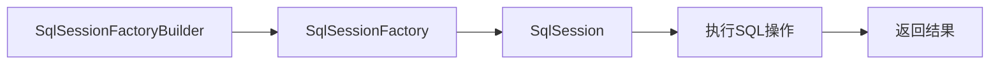

# 第3章 MyBatis 核心对象与执行流程

> 本章目标：掌握 MyBatis 的核心接口与类、执行流程、映射器（Mapper）的作用与实现方式，以及执行 SQL 的两种主要方式。

---

## 一、MyBatis 三大核心要素

1. **核心接口与类**
2. **MyBatis 核心配置文件（mybatis-config.xml）**
3. **SQL 映射文件（mapper.xml）**

---

## 二、MyBatis 核心对象

### 1️⃣ SqlSessionFactoryBuilder

- **作用**：根据配置文件或 `Configuration` 实例创建 `SqlSessionFactory` 对象。  
- **典型用法**：

  ```java
  InputStream inputStream = Resources.getResourceAsStream("mybatis-config.xml");
  SqlSessionFactory factory = new SqlSessionFactoryBuilder().build(inputStream);
  ```

- **源码分析**  
  `SqlSessionFactoryBuilder` 提供多个重载的 `build()` 方法：

  ```java
  build(InputStream inputStream, String environment, Properties properties);
  build(Reader reader, String environment, Properties properties);
  build(Configuration config);
  ```

    - 支持三种配置方式：  
        - 通过字节流（InputStream）读取 XML  
        - 通过字符流（Reader）读取 XML  
        - 通过 Java 代码（Configuration 对象）构建  

- **生命周期与作用域**：  
    - 用完即丢，只在构建 `SqlSessionFactory` 时存在。  
    - 最佳范围：**方法体内部局部变量**。

---

### 2️⃣ SqlSessionFactory

- **作用**：负责创建 `SqlSession` 实例，是 MyBatis 的核心工厂接口。  
- **接口定义**：

  ```java
  public interface SqlSessionFactory {
      SqlSession openSession();
      SqlSession openSession(boolean autoCommit);
      SqlSession openSession(Connection connection);
      SqlSession openSession(TransactionIsolationLevel level);
      SqlSession openSession(ExecutorType execType);
      Configuration getConfiguration();
  }
  ```

- **特点**：
    - 线程安全、可全局复用。  
    - 一旦创建，在整个应用程序生命周期内存在。  
    - 通常采用**单例模式**。

- **生命周期与作用域**：  
    - 生命周期与应用程序一致。  
    - 作用域：**Application 全局单例**。

---

### 3️⃣ SqlSession

- **作用**：负责执行数据库操作的接口，是 MyBatis 最常用的对象。
- **常用方法**：

  ```java
  <T> T getMapper(Class<T> type);
  int insert(String statement, Object parameter);
  int update(String statement, Object parameter);
  int delete(String statement, Object parameter);
  <E> List<E> selectList(String statement, Object parameter);
  <T> T selectOne(String statement, Object parameter);
  void commit(boolean force);
  void rollback(boolean force);
  void clearCache();
  ```

- **主要用途**：
  1. **获取映射器**：`getMapper()` 获取接口代理对象执行 SQL。  
  2. **直接执行 SQL**：通过 `"namespace + id"` 方式执行语句。

- **生命周期与作用域**：  
    - 对应一次数据库会话（类似 JDBC Connection）。  
    - 线程不安全，每个线程应独立使用。  
    - 最佳作用域：**方法体或 request 级别**。

---

### 4️⃣ Mapper（映射器）

- **定义**：
  映射器由 **Java 接口 + XML 文件（或注解）** 组成，负责定义 SQL、参数与返回值映射规则。
- **作用**：
    - 定义参数类型与返回类型；
    - 编写 SQL（包括动态 SQL）；
    - 定义 POJO 与数据库字段映射；
    - 绑定缓存配置。
- **命名空间**：
  每个 `mapper.xml` 顶层 `<mapper>` 标签的 `namespace` 必须与接口全限定名一致。

---

## 三、SqlSessionFactoryBuilder → SqlSessionFactory → SqlSession 流程



- ① `SqlSessionFactoryBuilder`：读取配置文件、构建工厂。  
- ② `SqlSessionFactory`：提供 `openSession()` 方法生成 SqlSession。  
- ③ `SqlSession`：执行 SQL 或通过 Mapper 调用。  
- ④ 自动或手动提交事务，返回结果集。

---

## 四、核心对象源码与关系图

```java
SqlSessionFactoryBuilder (构造者)
        ↓
SqlSessionFactory (工厂接口)
        ↓
SqlSession (数据库会话)
        ↓
MapperProxy (接口代理)
        ↓
Executor (执行器)
        ↓
StatementHandler / ParameterHandler / ResultSetHandler
        ↓
JDBC
```

---

## 五、SqlSessionFactoryBuilder 的使用示例

```java
InputStream inputStream = Resources.getResourceAsStream("mybatis-config.xml");
SqlSessionFactoryBuilder builder = new SqlSessionFactoryBuilder();
SqlSessionFactory factory = builder.build(inputStream);

try (SqlSession session = factory.openSession()) {
    UserMapper mapper = session.getMapper(UserMapper.class);
    List<User> users = mapper.selectAllUsers();
    users.forEach(System.out::println);
}
```

---

## 六、SqlSessionFactory 与事务管理

- 可创建不同类型的 SqlSession：

  ```java
  SqlSession session1 = factory.openSession();           // 默认，需手动提交
  SqlSession session2 = factory.openSession(true);       // 自动提交
  SqlSession session3 = factory.openSession(ExecutorType.BATCH); // 批处理模式
  ```

- 事务方法：

  ```java
  session.commit();
  session.rollback();
  session.clearCache();
  ```

---

## 七、Mapper 映射器详解

### 1️⃣ XML 方式实现

**接口：**

```java
package net.biancheng.mapper;
import java.util.List;
import net.biancheng.po.Website;

public interface WebsiteMapper {
    List<Website> selectAllWebsite();
}
```

**XML 文件：WebsiteMapper.xml**

```xml
<?xml version="1.0" encoding="UTF-8"?>
<!DOCTYPE mapper
PUBLIC "-//mybatis.org//DTD Mapper 3.0//EN"
"http://mybatis.org/dtd/mybatis-3-mapper.dtd">
<mapper namespace="net.biancheng.mapper.WebsiteMapper">
    <!-- 查询所有网站信息 -->
    <select id="selectAllWebsite" resultType="net.biancheng.po.Website">
        select * from website
    </select>
</mapper>
```

**在 mybatis-config.xml 注册映射器：**

```xml
<mappers>
  <mapper resource="net/biancheng/mapper/WebsiteMapper.xml"/>
</mappers>
```

---

### 2️⃣ 注解方式实现

```java
package net.biancheng.mapper;
import java.util.List;
import org.apache.ibatis.annotations.Select;
import net.biancheng.po.Website;

public interface WebsiteMapper2 {
    @Select("select * from website")
    List<Website> selectAllWebsite();
}
```

- **优点**：无需 XML，简单直观。  
- **缺点**：SQL 复杂时不易维护、不可引入复用片段 `<sql>`。  
- **覆盖规则**：当注解与 XML 同时存在时，**XML 优先生效**。

---

## 八、MyBatis 执行 SQL 的两种方式

### 1️⃣ 通过 SqlSession 直接执行 SQL

```java
Website website = session.selectOne("net.biancheng.mapper.WebsiteMapper.getWebsite", 1);
```

- **常用方法**：
    - `selectOne(String id, Object param)`：查询单条记录。
    - `selectList(String id, Object param)`：查询多条记录。
    - `insert(String id, Object param)`：执行插入语句。
    - `update(String id, Object param)`：执行更新语句。
    - `delete(String id, Object param)`：执行删除语句。

**示例：**

```java
List<Website> sites = session.selectList("net.biancheng.mapper.WebsiteMapper.selectAllWebsite");
```

---

### 2️⃣ 通过 Mapper 接口执行 SQL

```java
WebsiteMapper mapper = session.getMapper(WebsiteMapper.class);
List<Website> list = mapper.selectAllWebsite();
```

- MyBatis 通过 `MapperProxy` 动态生成接口实现类，自动定位到对应的 SQL。
- 调用方式更直观：`mapper.getWebsite(1)`。

---

### 3️⃣ 区别总结

| 对比项 | SqlSession 直接执行 | Mapper 接口执行 |
|---------|----------------------|----------------|
| 可读性 | 低，需要手写 SQL id | 高，面向对象 |
| 错误提示 | 运行期报错 | 编译期校验（IDE 支持） |
| 可维护性 | 低，SQL 分散 | 高，统一集中 |
| 推荐程度 | ❌ 不推荐 | ✅ 推荐 |

---

## 九、综合示例

```java
public class Test {
    public static void main(String[] args) throws IOException {
        InputStream config = Resources.getResourceAsStream("mybatis-config.xml");
        SqlSessionFactory ssf = new SqlSessionFactoryBuilder().build(config);
        SqlSession ss = ssf.openSession();

        WebsiteMapper websiteMapper = ss.getMapper(WebsiteMapper.class);
        List<Website> list = websiteMapper.selectAllWebsite();

        for (Website site : list) {
            System.out.println(site);
        }

        ss.commit();
        ss.close();
    }
}
```

**控制台输出：**

```bash
DEBUG [main] - ==> Preparing: select * from website
DEBUG [main] - ==> Parameters:
DEBUG [main] - <== Total: 1
Website[id=1, name=编程帮, url=https://www.biancheng.net/, age=21, country=CN]
```

---

## 十、最佳实践

- `SqlSessionFactory` 建议全局单例，`SqlSession` 每次使用后立即关闭。  
- XML 与注解同时存在时，XML 优先。  
- Mapper 文件的 `namespace` 必须与接口全限定名一致。  
- 大多数企业项目中以 **XML 映射文件为主**，注解仅用于简单查询。  
- 推荐通过 **Mapper 接口方式执行 SQL**，更易维护与调试。

---

✅ **总结**：
MyBatis 的核心是“会话工厂 + 会话 + 映射器”三层结构。理解各自职责与生命周期，是掌握高级特性（缓存、插件、动态 SQL）的前提。
