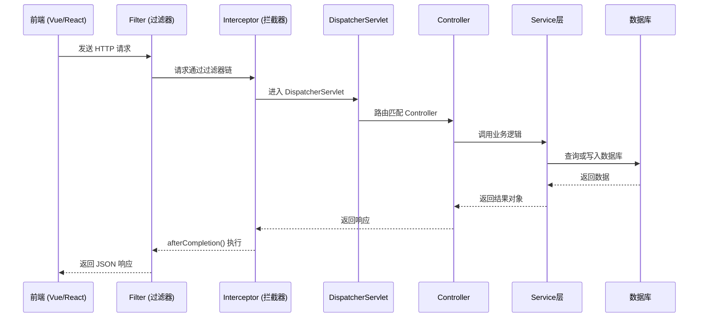
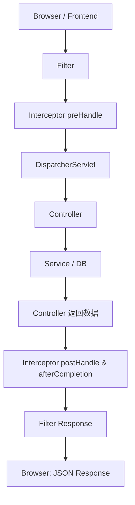

# Spring Boot MVC 扩展详解

> 本章聚焦于前后端分离架构下 Spring Boot MVC 的核心扩展与应用，系统讲解拦截器、过滤器、CORS、静态资源、国际化配置，并通过通信流程图和时序图展示整个请求生命周期。

---

## 🎯 一、课程目标

通过本章学习，你将掌握：

- Spring Boot MVC 在前后端分离架构中的角色和职责  
- CORS 跨域机制与全局配置方法  
- 拦截器与过滤器的作用、区别与执行时机  
- 前端打包与后端静态资源整合（前后端一体化部署）  
- 国际化（i18n）配置与语言切换  
- 请求完整执行流程及实战配置案例  

---

## 🌐 二、前后端通信架构图

前后端分离系统中，浏览器与后端通过 **HTTP API(JSON)** 进行交互。  
Spring Boot 主要负责处理业务逻辑、鉴权、数据访问与响应生成。



---

## 🧩 三、Spring Boot MVC 在前后端分离中的职责

| 模块 | 职责 | 常用技术 |
|------|------|-----------|
| Controller | 接收请求 / 返回 JSON | `@RestController`, `@RequestMapping` |
| Service | 业务逻辑处理 | `@Service`, 事务、缓存 |
| Repository | 数据访问层 | JPA / MyBatis / Redis |
| Interceptor | 请求前后处理 | 登录校验、权限、日志 |
| Filter | 全局过滤 | XSS、编码、IP控制 |
| CORS | 解决跨域 | `@CrossOrigin`, `CorsRegistry` |

---

## 🔗 四、CORS 跨域资源共享

### 1️⃣ 为什么会出现跨域问题？

浏览器出于安全考虑，默认禁止前端脚本访问不同源（协议/域名/端口）的接口。  
例如：`http://localhost:5173` 访问 `http://localhost:8080` 就会被拦截。

### 2️⃣ 全局 CORS 配置

```java
@Configuration
public class CorsConfig implements WebMvcConfigurer {
    @Override
    public void addCorsMappings(CorsRegistry registry) {
        registry.addMapping("/**")
                .allowedOriginPatterns("*")
                .allowedMethods("GET", "POST", "PUT", "DELETE", "OPTIONS")
                .allowedHeaders("*")
                .allowCredentials(true)
                .maxAge(3600);
    }
}
```

### 3️⃣ 单接口 CORS 示例

```java
@RestController
@RequestMapping("/api/users")
@CrossOrigin(origins = "http://localhost:5173")
public class UserController {
    @GetMapping
    public List<User> list() { return service.findAll(); }
}
```

> ✅ 推荐：开发环境开启全局 CORS，生产环境限制指定域名。

---

## 🚧 五、拦截器（Interceptor）

### 1️⃣ 概念

拦截器作用于 **Controller 前后**，是实现登录校验、权限验证、日志统计的常用机制。

### 2️⃣ 生命周期方法

| 方法 | 执行时机 | 常用用途 |
|------|-----------|----------|
| `preHandle()` | Controller 之前 | 登录鉴权、限流控制 |
| `postHandle()` | Controller 执行后、视图渲染前 | 修改响应数据 |
| `afterCompletion()` | 请求结束后 | 清理资源、日志输出 |

### 3️⃣ 登录校验拦截器示例

```java
@Component
public class AuthInterceptor implements HandlerInterceptor {
    @Override
    public boolean preHandle(HttpServletRequest req, HttpServletResponse res, Object handler) throws Exception {
        String token = req.getHeader("Authorization");
        if (token == null || !token.startsWith("Bearer ")) {
            res.setStatus(HttpServletResponse.SC_UNAUTHORIZED);
            return false;
        }
        return true;
    }
}
```

### 4️⃣ 注册拦截器

```java
@Configuration
public class WebConfig implements WebMvcConfigurer {
    @Autowired private AuthInterceptor authInterceptor;

    @Override
    public void addInterceptors(InterceptorRegistry registry) {
        registry.addInterceptor(authInterceptor)
                .addPathPatterns("/api/**")
                .excludePathPatterns("/api/auth/**");
    }
}
```

---

## 🧱 六、过滤器（Filter）

### 1️⃣ 作用与特性

过滤器在 **DispatcherServlet 之前执行**，适用于请求预处理（日志、XSS、编码）。

### 2️⃣ 示例

```java
@Component
@Order(1)
public class LoggingFilter implements Filter {
    @Override
    public void doFilter(ServletRequest req, ServletResponse res, FilterChain chain)
            throws IOException, ServletException {
        HttpServletRequest request = (HttpServletRequest) req;
        System.out.println("Filter: " + request.getMethod() + " " + request.getRequestURI());
        chain.doFilter(req, res);
    }
}
```

### 3️⃣ Filter 与 Interceptor 对比

| 对比项 | Filter | Interceptor |
|---------|---------|--------------|
| 执行位置 | DispatcherServlet 之前 | Controller 调用前后 |
| 拦截范围 | 所有请求（含静态资源） | 仅 MVC 控制器请求 |
| 主要用途 | 日志、XSS、CORS | 登录、权限、限流 |
| 注册方式 | `@WebFilter` / `FilterRegistrationBean` | `WebMvcConfigurer.addInterceptors()` |

---

## 📦 七、静态资源与一体化部署（补充）

在前后端分离架构中，前端通常独立部署。  
但若需要一体打包（如内网系统），可将前端构建产物放入 Spring Boot `static/` 目录。

```bash
npm run build
cp -r dist/* src/main/resources/static/
```

访问地址即为 `http://localhost:8080/`。

---

## 🌍 八、国际化（i18n）

```yaml
spring:
  messages:
    basename: i18n/messages
    encoding: UTF-8
```

文件结构：

```java
src/main/resources/i18n/
 ├── messages.properties
 ├── messages_en_US.properties
 └── messages_ja_JP.properties
```

```java
@GetMapping("/hello")
public String hello(Locale locale) {
    return messageSource.getMessage("welcome.message", null, locale);
}
```

访问 `/hello?lang=en` 即切换语言。

---

## ⚙️ 九、完整请求执行流程图



---

## 🧪 十、综合实战配置

```java
@Configuration
public class WebConfig implements WebMvcConfigurer {
    private final AuthInterceptor authInterceptor;

    public WebConfig(AuthInterceptor authInterceptor) { this.authInterceptor = authInterceptor; }

    @Override
    public void addInterceptors(InterceptorRegistry registry) {
        registry.addInterceptor(authInterceptor).addPathPatterns("/api/**").excludePathPatterns("/api/auth/**");
    }

    @Override
    public void addCorsMappings(CorsRegistry registry) {
        registry.addMapping("/api/**").allowedOrigins("http://localhost:5173").allowedMethods("*").allowCredentials(true);
    }
}
```

---

## 📘 十一、课堂练习

1️⃣ 编写一个前后端分离项目：  

- 前端：Vue / React 发起 `/api/users` 请求。  
- 后端：Spring Boot 提供接口并启用全局 CORS。  

2️⃣ 增加登录拦截器：验证 `Authorization` 头。  

3️⃣ 将前端打包文件整合进后端 `static`，实现一体运行（可选）。  

---

> 💡 **总结**：  
>
> - Filter 在最外层执行，请求预处理。  
> - Interceptor 在业务层前后切入，适合权限控制。  
> - CORS 是前后端通信的基础配置。  
> - MVC 的灵活扩展能力让 Spring Boot 成为现代前后端分离架构的坚实后端支撑。
