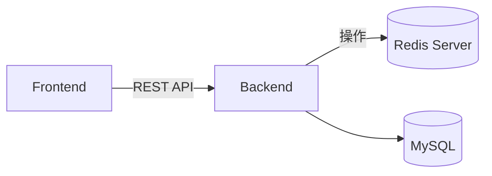
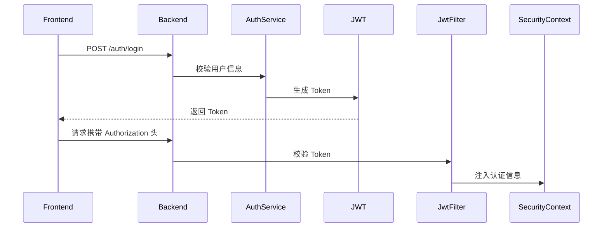
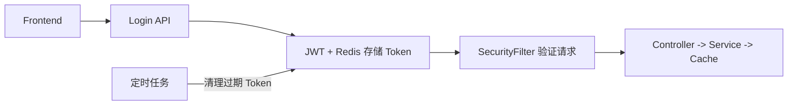

# Spring Boot 常用模块详解

> 本课程面向前后端分离企业项目，讲解 Redis、Spring Security、Spring Cache 与定时任务在高并发系统中的整合应用。
> 案例背景：模拟电商系统的“用户登录认证 + 缓存 + 定时任务清理机制”。

---

## 🎯 学习目标

- 掌握四大常用模块的原理与企业场景用法。
- 理解配置项、参数与运行机制。
- 能够设计登录认证、缓存与异步任务联动系统。

---

## 一、Redis 模块（高性能缓存与分布式会话）

### 1️⃣ 模块作用

Redis 是内存型数据库，广泛用于：

- 登录 Token 存储与黑名单
- 验证码缓存、防暴力破解
- 热点数据缓存（商品详情、库存）
- 分布式锁与异步消息处理

### 2️⃣ 前后端分离架构中的角色



> 前端请求 -> 后端验证 -> 缓存查询 -> 减少数据库访问

### 3️⃣ 配置讲解（application.yml）

```yaml
spring:
  data:
    redis:
      host: localhost          # Redis 服务器地址
      port: 6379               # Redis 端口
      database: 0              # 使用的逻辑数据库索引
      lettuce:
        pool:
          max-active: 8        # 最大连接数
          max-idle: 8          # 最大空闲连接数
          min-idle: 0          # 最小空闲连接
          max-wait: 1ms        # 等待连接最大时间
```

💡 **讲解要点：**

- `max-active`: 控制最大并发连接数，防止连接爆满。  
- `max-wait`: 避免线程长时间等待连接。  
- 建议搭配 `spring.cache.type=redis` 启用缓存整合。

### 4️⃣ 配置类逐行讲解

```java
@Configuration
public class RedisConfig {

    @Bean
    public RedisTemplate<String, Object> redisTemplate(RedisConnectionFactory factory) {
        RedisTemplate<String, Object> template = new RedisTemplate<>(); // 创建模板
        template.setConnectionFactory(factory);                        // 绑定连接工厂
        template.setKeySerializer(new StringRedisSerializer());         // Key 序列化为字符串
        template.setValueSerializer(new GenericJackson2JsonRedisSerializer()); // Value 转为 JSON
        template.afterPropertiesSet();                                  // 初始化
        return template;
    }
}
```

### 5️⃣ 实战案例：Token 管理

```java
@Service
@RequiredArgsConstructor
public class TokenService {
    private final RedisTemplate<String, Object> redis;

    // 保存 Token 并设置过期时间
    public void saveToken(String userId, String token) {
        redis.opsForValue().set("auth:token:" + userId, token, 1, TimeUnit.HOURS); // 过期 1 小时
    }

    // 校验 Token
    public boolean isValid(String userId, String token) {
        String key = "auth:token:" + userId;
        Object saved = redis.opsForValue().get(key);
        return token.equals(saved);
    }
}
```

---

## 二、Spring Security 模块（JWT 无状态认证）

### 1️⃣ 模块作用

提供认证与授权机制；结合 JWT 可实现无状态登录。

### 2️⃣ 登录流程



### 3️⃣ 配置逐行说明

```java
@Configuration
@EnableWebSecurity
public class SecurityConfig {

    @Bean
    SecurityFilterChain filterChain(HttpSecurity http) throws Exception {
        return http
            .csrf(AbstractHttpConfigurer::disable)                        // 关闭 CSRF，前后端分离用 JWT
            .authorizeHttpRequests(auth -> auth
                .requestMatchers("/auth/**").permitAll()                  // 登录接口放行
                .anyRequest().authenticated())                            // 其他接口需登录
            .addFilterBefore(new JwtAuthFilter(), UsernamePasswordAuthenticationFilter.class)
            .build();
    }
}
```

### 4️⃣ JWT 鉴权过滤器

```java
@Component
public class JwtAuthFilter extends OncePerRequestFilter {
    @Autowired private JwtUtil jwt;

    @Override
    protected void doFilterInternal(HttpServletRequest req, HttpServletResponse res, FilterChain chain)
            throws ServletException, IOException {
        String header = req.getHeader("Authorization");                   // 从请求头取 Token
        if (header != null && header.startsWith("Bearer ")) {
            String token = header.substring(7);
            String username = jwt.extractUsername(token);                 // 解析 Token
            if (username != null && jwt.validateToken(token)) {
                UsernamePasswordAuthenticationToken auth =
                    new UsernamePasswordAuthenticationToken(username, null, List.of());
                SecurityContextHolder.getContext().setAuthentication(auth);
            }
        }
        chain.doFilter(req, res);                                         // 放行请求
    }
}
```

---

## 三、Spring Cache 模块

### 1️⃣ 模块作用

缓存查询结果，减少数据库压力。

### 2️⃣ 配置与注解说明

```java
@EnableCaching
@Service
public class ProductService {

    @Cacheable(value="products", key="#id")     // 第一次查询后缓存结果
    public Product find(Long id) {
        System.out.println("查询数据库...");
        return repo.findById(id).orElseThrow();
    }

    @CacheEvict(value="products", key="#id")    // 删除缓存
    public void delete(Long id) { repo.deleteById(id); }
}
```

### 3️⃣ 使用场景

- 商品、用户资料、配置项缓存
- 查询频繁但变动少的数据

---

## 四、定时任务模块

### 1️⃣ 模块作用

定期执行任务（清理缓存、生成报表等）。

### 2️⃣ 示例

```java
@EnableScheduling
@Component
public class CacheCleanupTask {

    @Scheduled(cron = "0 0 * * * ?") // 每小时执行
    public void cleanExpiredCache() {
        System.out.println("清理过期缓存...");
    }
}
```

---

## 五、综合实战案例：用户登录与缓存清理系统



💡 **业务逻辑说明：**

1. 用户登录后生成 JWT 并存储在 Redis。  
2. Redis 缓存 Token + 用户信息。  
3. Spring Cache 缓存业务查询结果。  
4. 定时任务定期清理 Redis 无效 Token。

---

## 🧪 课堂练习

1. 实现登录接口 + JWT 认证。  
2. 使用 Redis 缓存登录 Token。  
3. 使用 Cache 缓存商品接口。  
4. 编写定时任务清理 Redis 中过期数据。
