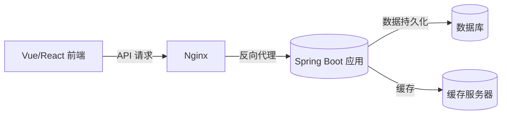

# Spring Boot 部署与运行机制

> 本教案针对前后端分离项目，讲解 Spring Boot 项目从本地开发到服务器部署的完整流程。
> 内容包括运行机制、打包方式、多环境配置、外部化参数、Nginx 反向代理、日志与进程守护。

---

## 一、Spring Boot 运行原理概述

Spring Boot 的核心特征是**可独立运行**（无需外部服务器）。  
其内嵌 Tomcat/Jetty，并通过 `SpringApplication.run()` 启动 IoC 容器与自动配置。

```mermaid
flowchart TD
A[main 方法执行] --> B[SpringApplication 初始化]
B --> C[加载 SpringFactories 自动配置]
C --> D[创建 IoC 容器]
D --> E[扫描 @Component 与配置类]
E --> F[创建 WebServer (Tomcat)]
F --> G[启动监听端口并接收请求]
```

💡 **关键点：**

- `@EnableAutoConfiguration` 会根据依赖自动装配组件。
- `SpringApplication` 会加载 `application.yml` 并合并外部配置。

---

## 二、项目打包与运行方式

Spring Boot 项目可通过 Maven 一键打包为 **可执行 Jar 包**。

### 1️⃣ 打包命令

```bash
mvn clean package -DskipTests
```

> 生成目标：`target/demo-0.0.1-SNAPSHOT.jar`

### 2️⃣ 运行命令

```bash
java -jar demo-0.0.1-SNAPSHOT.jar --spring.profiles.active=prod
```

> `--spring.profiles.active` 用于指定运行环境。

### 3️⃣ War 打包（补充）

若需部署到外部 Tomcat：

```java
@SpringBootApplication
public class Application extends SpringBootServletInitializer {
  @Override
  protected SpringApplicationBuilder configure(SpringApplicationBuilder builder) {
    return builder.sources(Application.class);
  }
}
```

---

## 三、多环境配置（Profiles）

### 1️⃣ 配置结构

Spring Boot 支持多环境配置文件自动加载：

```java
application.yml
application-dev.yml
application-test.yml
application-prod.yml
```

### 2️⃣ 示例配置

```yaml
# application.yml
spring:
  profiles:
    active: dev    # 默认激活开发环境
server:
  port: 8080
---
# application-dev.yml
spring:
  datasource:
    url: jdbc:mysql://localhost:3306/dev_db
    username: root
    password: 123456
---
# application-prod.yml
spring:
  datasource:
    url: jdbc:mysql://10.0.0.5:3306/prod_db
    username: admin
    password: xxxxxx
  server:
    port: 8081
```

💡 **讲解要点：**

- `application.yml` 可同时定义多个文档块（用 `---` 分隔）。  
- 也可单独创建 `application-dev.yml` 等文件。  
- 优先级：命令行参数 > 环境变量 > 外部配置文件 > 内部配置。

### 3️⃣ 环境切换方式

```bash
# 方法1：命令行参数
java -jar app.jar --spring.profiles.active=prod

# 方法2：环境变量
export SPRING_PROFILES_ACTIVE=prod

# 方法3：IDE 运行配置中设置 VM Options
-Dspring.profiles.active=test
```

---

## 四、外部化配置优先级

Spring Boot 启动时会自动加载以下配置来源（从高到低）：

| 优先级 | 来源 | 说明 |
|--------|------|------|
| 1 | 命令行参数 | `--server.port=9000` |
| 2 | Java 系统属性 | `-Dserver.port=9000` |
| 3 | 环境变量 | `SERVER_PORT=9000` |
| 4 | `application.yml` | 默认项目配置 |
| 5 | 内部默认配置 | 来自依赖 Jar 的默认配置 |

💡 **应用场景：**

- 生产环境常使用外部化配置以避免修改 Jar 文件。

---

## 五、部署架构与流程

### 1️⃣ 前后端分离部署架构图



### 2️⃣ Nginx 反向代理配置

**示例：** `/etc/nginx/conf.d/app.conf`

```nginx
server {
  listen 80;
  server_name example.com;

  location /api/ {
    proxy_pass http://127.0.0.1:8081/;   # 转发给 Spring Boot
    proxy_set_header Host $host;
    proxy_set_header X-Real-IP $remote_addr;
  }

  location / {
    root /usr/share/nginx/html;          # 前端静态资源目录
    index index.html;
  }
}
```

💡 **讲解：**

- `/api/` 反向代理后端接口；`/` 提供前端资源。  
- `proxy_set_header` 保留客户端 IP。  
- 前后端分离中，前端通过 Nginx 部署在 `/usr/share/nginx/html`。

---

## 六、Linux 部署实战

### 1️⃣ 上传与运行

```bash
scp target/demo.jar user@server:/opt/app/
ssh user@server
cd /opt/app
nohup java -jar demo.jar --spring.profiles.active=prod > app.log 2>&1 &
```

> `nohup` 让程序在后台持续运行。

### 2️⃣ systemd 服务守护配置

`/etc/systemd/system/demo.service`

```ini
[Unit]
Description=Spring Boot Application
After=network.target

[Service]
User=appuser
ExecStart=/usr/bin/java -jar /opt/app/demo.jar --spring.profiles.active=prod
SuccessExitStatus=143
Restart=on-failure
StandardOutput=append:/var/log/demo.log
StandardError=append:/var/log/demo.err

[Install]
WantedBy=multi-user.target
```

### 3️⃣ 常用命令

```bash
sudo systemctl daemon-reload
sudo systemctl enable demo
sudo systemctl start demo
sudo systemctl status demo
sudo journalctl -u demo -f
```

---

## 七、日志与监控

### 1️⃣ 日志配置

```yaml
logging:
  level:
    root: INFO
    com.example.demo: DEBUG
  file:
    name: /var/log/springboot/app.log
  pattern:
    console: "%d{yyyy-MM-dd HH:mm:ss} %-5level %logger{36} - %msg%n"
```

💡 **重点说明：**

- `logging.file.name` 指定日志文件路径。
- `logging.level` 控制不同包的日志级别。
- `pattern.console` 定义输出格式。

### 2️⃣ 健康检查端点

Spring Boot Actuator 提供监控端点：

```xml
<dependency>
  <groupId>org.springframework.boot</groupId>
  <artifactId>spring-boot-starter-actuator</artifactId>
</dependency>
```

`application.yml` 示例：

```yaml
management:
  endpoints:
    web:
      exposure:
        include: health,info
```

访问：`http://localhost:8081/actuator/health`

---

## 八、课堂任务

1️⃣ 配置多环境（dev/test/prod）数据库。  
2️⃣ 使用 Nginx 实现前后端分离部署。  
3️⃣ 配置 systemd 服务守护程序。  
4️⃣ 启用 Actuator 监控端点。  
5️⃣ 调整日志级别并验证文件输出。
