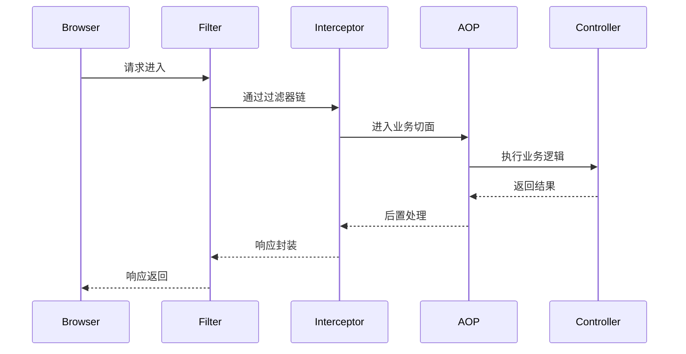
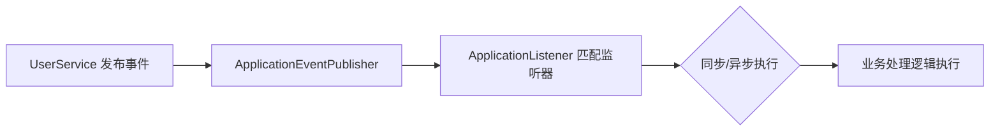

# Spring Boot 自动配置、AOP 与事件机制

> 本章为 Spring Boot 核心原理与企业级应用扩展讲解，适用于中高级开发者。
> 内容覆盖自动配置加载流程、AOP 面向切面编程、Spring 事件机制三大核心模块。
> 并结合前后端分离项目场景，讲解统一日志、权限审计、异步通知等实战案例。

---

## 一、Spring Boot 自动配置原理

### 1️⃣ 自动配置的核心思想

Spring Boot 的「约定优于配置」依赖于自动配置机制（AutoConfiguration）。  
通过 **@EnableAutoConfiguration** 自动导入一系列基于条件判断的配置类，实现组件自动装配。

```java
@SpringBootApplication
public class DemoApplication {
  public static void main(String[] args) {
    SpringApplication.run(DemoApplication.class, args);
  }
}
```

> 该注解内部包含：`@EnableAutoConfiguration` → `@Import(AutoConfigurationImportSelector.class)`。

`AutoConfigurationImportSelector` 会从以下位置加载所有自动配置：  

```java
META-INF/spring.factories  (Spring Boot 2.x)
META-INF/spring/org.springframework.boot.autoconfigure.AutoConfiguration.imports (Spring Boot 3.x)
```

### 2️⃣ 加载机制流程图

```mermaid
flowchart TD
A[SpringApplication.run()] --> B[读取 spring.factories]
B --> C[扫描所有 AutoConfiguration 类]
C --> D[匹配 @Conditional 条件注解]
D --> E[注册满足条件的 Bean 到容器]
E --> F[应用启动完成，Bean 可用]
```

### 3️⃣ 条件注解 @Conditional 家族

| 注解 | 说明 |
|------|------|
| @ConditionalOnClass | 指定类存在时生效 |
| @ConditionalOnMissingBean | 当容器中不存在指定 Bean 时生效 |
| @ConditionalOnProperty | 根据配置文件属性值启用或禁用 |
| @ConditionalOnWebApplication | 当前环境为 Web 应用时生效 |
| @ConditionalOnExpression | 使用 SpEL 表达式判断 |

**示例：**

```java
@Configuration
@ConditionalOnClass(name = "com.mysql.cj.jdbc.Driver")
public class MyDataSourceAutoConfig {

  @Bean
  @ConditionalOnMissingBean
  public DataSource dataSource() {
    return DataSourceBuilder.create()
      .url("jdbc:mysql://localhost:3306/demo")
      .username("root")
      .password("123456")
      .build();
  }
}
```

### 4️⃣ 自定义 Starter 案例

```text
spring-boot-starter-hello/
 ├─ src/main/java/com/example/hello/
 │   ├─ HelloAutoConfiguration.java
 │   └─ HelloService.java
 └─ resources/META-INF/spring/org.springframework.boot.autoconfigure.AutoConfiguration.imports
```

**HelloAutoConfiguration.java**

```java
@Configuration
@ConditionalOnMissingBean(HelloService.class)
public class HelloAutoConfiguration {
  @Bean
  public HelloService helloService() {
    return new HelloService("Spring Boot Starter Hello!");
  }
}
```

**配置文件 (AutoConfiguration.imports)**

```java
com.example.hello.HelloAutoConfiguration
```

在其他项目中引入依赖后，无需配置即可使用：

```java
@Autowired HelloService hello;
System.out.println(hello.sayHello());
```

---

## 二、AOP（面向切面编程）

### 1️⃣ AOP 概念与应用场景

AOP（Aspect-Oriented Programming）用于将横切关注点（如日志、事务、安全、性能监控）与业务逻辑解耦。

在前后端分离项目中常用于：

- 接口访问日志记录
- 权限校验（基于注解的接口安全控制）
- 性能统计与异常报警

### 2️⃣ 核心概念

| 名称 | 含义 |
|------|------|
| JoinPoint | 程序执行点（方法调用等） |
| Pointcut | 切入点，定义匹配规则 |
| Advice | 增强逻辑（Before/After/Around） |
| Aspect | 切面，整合切入点与增强 |
| Weaving | 将切面织入目标对象的过程 |

### 3️⃣ 常用注解

| 注解 | 说明 |
|------|------|
| @Aspect | 声明切面类 |
| @Before | 方法执行前执行 |
| @After | 方法执行后执行 |
| @AfterReturning | 方法正常返回后执行 |
| @AfterThrowing | 抛出异常后执行 |
| @Around | 环绕执行，可控制方法是否继续 |

### 4️⃣ 实战案例：接口日志切面

```java
@Aspect
@Component
public class LogAspect {

  @Pointcut("execution(* com.example.demo.controller..*(..))")
  public void logPointcut() {}

  @Around("logPointcut()")
  public Object logAround(ProceedingJoinPoint joinPoint) throws Throwable {
    long start = System.currentTimeMillis();
    String method = joinPoint.getSignature().toShortString();
    System.out.println("[LOG] Start -> " + method);
    Object result = joinPoint.proceed();
    long end = System.currentTimeMillis();
    System.out.println("[LOG] End -> " + method + " (" + (end - start) + "ms)");
    return result;
  }
}
```

> 在前后端分离项目中，可用于记录接口耗时与请求参数。

### 5️⃣ AOP 与拦截器 / 过滤器 对比

| 特性 | AOP | HandlerInterceptor | Filter |
|------|------|-------------------|--------|
| 级别 | Spring 层 | Spring MVC 层 | Servlet 容器层 |
| 作用范围 | 方法调用 | Controller 请求 | 所有 HTTP 请求 |
| 典型用途 | 日志、事务、权限 | 登录验证、参数处理 | 编码、跨域、XSS 防护 |
| 执行时机 | 调用方法时 | 控制器执行前后 | 请求进入容器时 |

### 6️⃣ 执行顺序图



---

## 三、Spring 事件机制

Spring 提供基于观察者模式的事件发布 / 监听体系。

### 1️⃣ 基本组成

| 组件 | 作用 |
|------|------|
| ApplicationEvent | 事件对象 |
| ApplicationEventPublisher | 事件发布者 |
| ApplicationListener | 事件监听器 |
| @EventListener | 注解方式监听事件 |

### 2️⃣ 示例：用户注册事件

```java
// 事件定义
public class UserRegisterEvent extends ApplicationEvent {
  private final String username;
  public UserRegisterEvent(Object source, String username) {
    super(source);
    this.username = username;
  }
  public String getUsername() { return username; }
}
```

```java
// 发布事件
@Service
public class UserService {
  @Autowired private ApplicationEventPublisher publisher;
  public void register(String username) {
    System.out.println("注册用户：" + username);
    publisher.publishEvent(new UserRegisterEvent(this, username));
  }
}
```

```java
// 监听事件
@Component
public class WelcomeEmailListener {
  @EventListener
  public void onRegister(UserRegisterEvent event) {
    System.out.println("发送欢迎邮件给：" + event.getUsername());
  }
}
```

### 3️⃣ 异步事件监听

```java
@EnableAsync
@Component
public class AsyncEventListener {
  @Async
  @EventListener
  public void handle(UserRegisterEvent event) {
    System.out.println("异步处理用户注册：" + event.getUsername());
  }
}
```

### 4️⃣ 事务事件监听

```java
@Component
public class TxEventListener {
  @TransactionalEventListener(phase = TransactionPhase.AFTER_COMMIT)
  public void afterCommit(UserRegisterEvent e) {
    System.out.println("事务提交后发送通知：" + e.getUsername());
  }
}
```

### 5️⃣ 事件流程图



---

## 四、综合实战：用户注册日志 + 异步事件通知

```java
@RestController
@RequestMapping("/users")
@RequiredArgsConstructor
public class UserController {
  private final UserService userService;
  @PostMapping("/register")
  public String register(@RequestParam String name) {
    userService.register(name);
    return "OK";
  }
}
```

- AOP 记录接口日志  
- 事件监听异步发送欢迎邮件  
- 可扩展为消息队列通知（Kafka/RabbitMQ）

---

## 五、课堂任务

1️⃣ 编写一个自定义 Starter：实现系统启动时输出公司名称。  
2️⃣ 使用 AOP 实现接口性能监控与异常捕获。  
3️⃣ 使用 Spring 事件机制在订单支付后发送短信通知。  
4️⃣ 思考：如果事件监听器异常，会不会影响主流程？  
