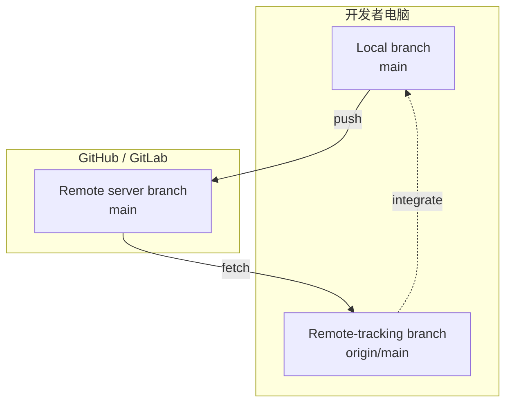
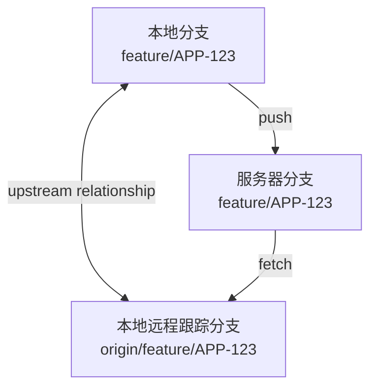

# 05 远程仓库与同步

## 5.1 本地分支与远程跟踪分支

远程仓库是团队共享的 Git 仓库。`origin` 是克隆时常见的远程名称，只是一个可更改的别名，并不是 Git 关键字。

```cmd
git remote -v
git remote get-url origin
```

克隆后常见的名称有：

- `main`：本地分支，可以直接提交
- `origin/main`：最近一次获取到的远程 `main` 状态，不能像普通本地分支一样直接提交
- `origin`：远程仓库别名

执行 `git fetch origin` 后，Git 更新 `origin/main` 等远程跟踪分支，但不会自动改动当前工作区。



三者名称相似，但并不是同一个 branch。`origin/main` 位于本地，是“本机上一次 fetch 后看到的服务器 main 状态”。

## 5.2 添加远程仓库

本地初始化的仓库可以添加远程地址：

```cmd
git remote add origin REPOSITORY_URL
git remote -v
```

远程地址填写错误时：

```cmd
git remote set-url origin NEW_REPOSITORY_URL
```

提交前不要把访问令牌嵌入 HTTPS 地址。优先使用系统凭据管理器、平台命令行工具（Command Line Interface，CLI）或 SSH。

## 5.3 fetch、pull 和 push

### 获取但不合并

假设服务器上的 `main` 已经从 B 前进到 C，而本地尚未获取：

```text
服务器 main:       A──B──C
本地 main:         A──B
本地 origin/main:  A──B
```

```cmd
git fetch origin
git log --oneline --graph --decorate --all
git diff main..origin/main
```

执行后：

```text
本地 main:         A──B
本地 origin/main:  A──B──C
```

`fetch` 更新 `origin/main`，不会自动移动本地 `main`，也不会自动改变 Working Tree。它适合先查看远程变化，再决定是否以及如何整合。

### 拉取并整合

```cmd
git pull --ff-only
```

`pull` 会先 fetch，再把当前分支与其上游分支整合。`--ff-only` 只允许快进，可以避免不知情地创建合并提交；如果双方已经分叉，命令会停止，由开发者根据团队规则选择 merge 或 rebase。

继续上面的场景，且本地没有独有提交时：

```text
pull 前
main:         A──B
origin/main:  A──B──C

git pull --ff-only

pull 后
main:         A──B──C
origin/main:  A──B──C
```

可以把 `pull` 理解为 `fetch + integrate`，但整合使用 merge、rebase 还是只允许 fast-forward，取决于命令选项和项目配置。

### 推送本地提交

首次推送并建立上游关系：

```cmd
git push -u origin main
```

之后在该分支通常可以直接执行：

```cmd
git push
```

`-u` 建立本地分支与远程分支的跟踪关系。使用以下命令检查：

```cmd
git branch -vv
```

首次推送功能分支前后可以这样理解：

```text
push 前
本地 feature/APP-123:  A──B──C──D
服务器：尚无该功能分支

git push -u origin feature/APP-123

push 后
本地分支:             feature/APP-123 -> D
本地远程跟踪分支:     origin/feature/APP-123 -> D
服务器分支:           feature/APP-123 -> D
```

### Upstream 是关系，不是第四种分支

Remote-tracking branch 是具体的本地引用，例如 `origin/feature/APP-123`；upstream（上游）则是本地分支与默认同步目标之间的关联：



`git push -u origin feature/APP-123` 中的 `-u`（`--set-upstream`）在首次推送时建立这项关联。之后 `git push` 和 `git pull` 才能在省略分支名时知道默认目标。`git branch -vv` 用方括号显示每个本地分支的 upstream。

### push 不等于 PR/MR

```text
git push:
本地功能分支 -> 服务器功能分支

Pull Request / Merge Request:
服务器功能分支 -> 请求合入服务器目标分支
```

push 是 Git 数据同步；PR/MR 是 GitHub/GitLab 等平台上的审查与合并请求。推送成功不会自动等于已经创建 PR，更不等于已经合并。

## 5.4 克隆和远程分支

```cmd
git clone REPOSITORY_URL
cd REPOSITORY_DIRECTORY
git remote -v
git branch --all
```

从已有远程分支创建本地跟踪分支：

```cmd
git fetch origin
git switch --track origin/feature/login
```

如果本地分支名与远程不同，可以明确指定：

```cmd
git switch -c local-login --track origin/feature/login
```

## 5.5 处理推送被拒绝

常见提示是远程分支包含本地没有的提交。不要立即强制推送。先取得并检查远程历史：

```text
! [rejected] main -> main (non-fast-forward)
error: failed to push some refs to 'REPOSITORY_URL'
```

`non-fast-forward` 表示远程分支不能只向前移动到本地位置，通常说明远程存在本地尚未取得的提交。

```cmd
git fetch origin
git status
git log --oneline --graph --decorate --all
```

然后按照团队策略选择：

```cmd
REM 保留合并关系
git merge origin/main

REM 或者，仅在允许整理当前分支历史时
git rebase origin/main
```

解决冲突并完成测试后再推送。受保护的 `main` 通常应通过 Pull Request 合并，而不是由开发者直接推送。

## 5.6 删除和重命名功能分支

删除已经合并的远程功能分支：

```cmd
git push origin --delete feature/old-name
git fetch --prune origin
```

重命名正在使用的共享分支会影响 Pull Request、CI、文档和其他开发者。普通功能分支需要重命名时，先在本地改名并推送新名称，确认成功后再删除旧远程分支：

```cmd
git branch -m feature/old-name feature/new-name
git push -u origin feature/new-name
git push origin --delete feature/old-name
```

不要仅按以上步骤重命名仓库默认分支；默认分支还需要修改托管平台设置、保护规则、流水线和所有引用。

## 5.7 实验：推送一个练习仓库

**环境与前置条件：** 已完成第 02 章认证配置；在 GitHub 或 GitLab 创建一个没有 README、许可证和 `.gitignore` 的空仓库。以下操作会在远程平台创建分支和提交。

```cmd
mkdir git-remote-lab
cd git-remote-lab
git init -b main
git config user.name "Git Learner"
git config user.email "learner@example.com"
echo # Git Remote Lab>README.md
git add README.md
git commit -m "docs: initialize remote lab"
git remote add origin REPOSITORY_URL
git remote -v
git push -u origin main
git branch -vv
```

在远程网页确认提交后，再创建功能分支：

```cmd
git switch -c feature/add-note
echo remote practice>note.txt
git add note.txt
git commit -m "docs: add remote practice note"
git push -u origin feature/add-note
```

由于认证、网络和平台权限依赖外部环境，本实验无法仅通过本地文档审计验证。失败时记录完整错误，重点检查远程地址、账号权限、SSH/HTTPS 凭据和网络限制。

## 5.8 常见错误

```text
fatal: 'origin' does not appear to be a git repository
```

远程名称不存在或地址错误。执行 `git remote -v` 检查名称和 URL。

```text
There is no tracking information for the current branch.
```

当前本地分支尚未关联上游。首次推送时使用 `git push -u origin BRANCH_NAME`，或按项目要求建立跟踪关系。

```text
Your branch and 'origin/main' have diverged
```

本地与远程都包含对方没有的提交。先 fetch 和查看提交图，再按团队规则 merge 或 rebase，不要直接强推。

## 5.9 本章总结

- `origin/main` 是本地保存的远程状态，不是远程服务器本身。
- `fetch` 只获取，`pull` 获取并整合，`push` 上传本地提交。
- 推送被拒绝时先 fetch 和查看历史，不要直接强推。
- 默认分支、共享分支和个人功能分支的变更策略不同。

## 练习

1. 使用 `git branch -vv` 找出当前分支的上游。
2. 比较 `main` 与 `origin/main`。
3. 解释为什么重命名默认分支不能只执行一条 Git 命令。

### 自检提示

- `git branch -vv` 中当前分支后面的方括号应显示上游，例如 `[origin/main]`。
- `git fetch` 后工作区文件不应自动变化。
- 重命名默认分支还要同步平台设置、CI、保护规则和文档引用。

[上一章：分支、合并与冲突](04_branches_and_merge.md) · [下一章：团队协作与代码评审](06_teamwork_and_conflicts.md)
