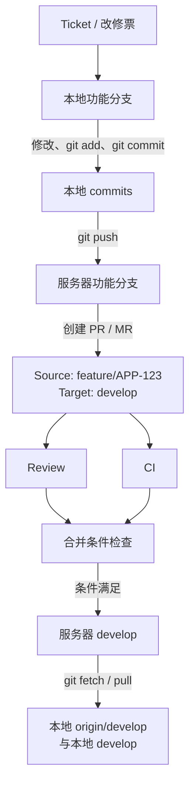
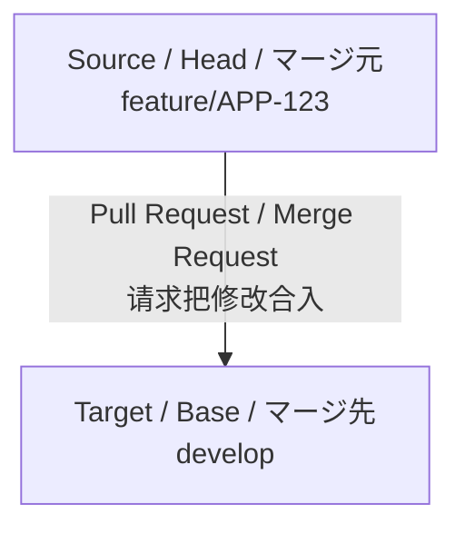
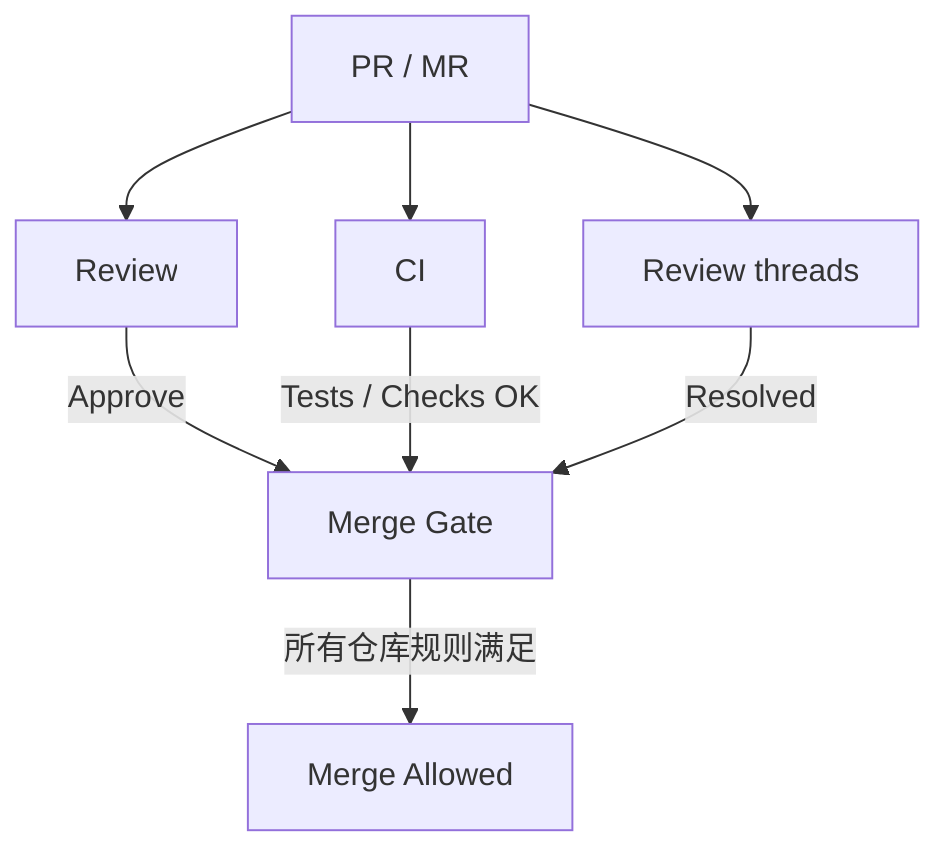

# 06 团队协作与代码评审

团队使用 Git 的目标不只是“把代码推上去”，而是让每次变更可以理解、验证、审查、合并和追溯。具体分支命名、审批人数和合并方式以所在项目规则为准。

下面的总图把本地 Git 操作和远程平台操作连接起来。示例目标分支使用 `develop`；实际项目也可能使用 `main`、发布分支或维护分支。



四个容易混淆的动作分别发生在不同位置：

| 动作 | 起点与终点 | 结果 |
|---|---|---|
| Commit | Working Tree / Staging → Local Branch | 本地新增提交 |
| Push | Local Branch → Remote Branch | 服务器得到功能分支提交 |
| PR/MR | Remote Feature Branch → 请求合入 Remote Target Branch | 建立审查和合并请求 |
| Merge | Remote Feature Branch → Remote Target Branch | 目标分支取得变更 |

PR 合并后服务器目标分支已经变化，但开发者电脑不会自动更新，所以还需要 fetch/pull。

## 6.1 一个完整的功能开发流程

以下流程适用于常见的短生命周期功能分支。短生命周期表示分支只服务一个任务，并尽快通过审查合并，避免长期偏离主分支。

1. 确认任务、验收条件和目标分支。
2. 更新本地默认分支。
3. 从最新默认分支创建功能分支。
4. 完成小而清晰的提交，并在本地验证。
5. 推送分支，创建 Pull Request 或 Merge Request。
6. 处理 CI 和 Review 意见。
7. 按团队策略合并，确认部署或发布结果。
8. 更新本地默认分支并清理已合并分支。

GitHub 通常称 Pull Request（PR），GitLab 通常称 Merge Request（MR），核心目的都是在合并前审查分支差异。Issue 是平台中记录需求、缺陷或任务的条目，分支和 PR 通常会引用对应 Issue 编号。

## 6.2 从最新 main 创建任务分支

本节用 `main` 演示；开始前必须先确认项目的真实派生元分支，不要因为示例使用 `main` 就自行决定分支策略。确认没有遗留修改后：

```cmd
git status
git switch main
git fetch origin
git pull --ff-only
git switch -c feature/123-user-login
```

分支名中的 `123` 可以对应 Issue 或任务编号。日本项目中可能使用工单番号、チケット番号或团队规定的前缀，必须以仓库规范为准。

不要在本地落后的 `main` 上长期开发，也不要为了更新代码而在状态不清楚时执行 rebase 或强制推送。

## 6.3 形成可审查提交

每完成一个逻辑完整的修改：

```cmd
git status
git diff
git add CHANGED_FILE
git diff --staged
REM 运行项目规定的测试、格式检查或构建
git commit -m "feat: validate login request"
```

一个提交应尽量只包含一个目的。以下内容通常应拆开：

- 功能开发与大规模格式化
- 问题修复与无关依赖升级
- 代码重构与行为变更

拆分后，Reviewer 更容易判断每次修改是否正确，也更容易独立回退。

## 6.4 推送并创建 PR

```cmd
git push -u origin feature/123-user-login
```

PR/MR 的 Source branch（源分支、マージ元）是提供修改的功能分支，Target branch（目标分支、マージ先）是准备接收修改的分支：



`feature/APP-123 → develop` 表示请求把功能分支的修改合入 `develop`，方向选反可能把大量无关差异带进 PR。创建前先核对 source、target、commits 和 changes。

平台界面会随 GitHub、GitLab 和企业版本变化，但通用操作顺序相同：

1. 打开目标 Repository，选择创建 Pull Request 或 Merge Request。
2. 选择 Source Branch 和 Target Branch。
3. 确认提交列表和文件差异只包含当前任务。
4. 填写标题和说明。
5. 指定 Reviewer；按项目需要设置 Assignee、Label 或 Milestone。
6. 再次确认目标分支后创建 PR/MR。

PR 描述至少应包含：

- 目的：解决哪个任务或问题
- 变更：主要修改和设计选择
- 影响范围：接口、数据库、配置、画面或兼容性
- 验证：执行了哪些测试及结果
- 补充材料：必要的截图、日志片段或迁移说明

日本项目中常见的说明形式如下，字段仍以所在项目模板为准：

```text
■ チケット
APP-123

■ 改修内容
ログイン時の入力チェックを追加

■ 変更ファイル
UserController.java
UserService.java

■ 影響範囲
ログイン処理、認証処理

■ テスト結果
T01～T05 OK

■ 未実施
なし
```

不要在 PR 中粘贴访问令牌、个人信息、生产数据或完整内部日志。尚未完成但希望提前获得方向反馈时，可以创建 Draft PR（草稿 PR）；它表示变更尚未准备合并，但允许团队提前查看方向和提出意见。完成开发、自测和说明后，再把它标记为 Ready for review。

## 6.5 处理 Review

Review 是对代码质量和风险的共同确认，不只是寻找语法错误；Reviewer 是负责检查本次变更的人。收到意见后：

1. 先理解问题和期望结果。
2. 不明确时在对应评论中确认。
3. 在同一功能分支完成修改和测试。
4. 推送新提交，让 PR 自动更新。
5. 回复修改内容和验证方式。

不要为了隐藏 Review 过程而频繁强制改写已共享分支。团队要求合并前整理提交时，再按规定 squash 或 rebase。

### Reviewer 的基本流程

```text
收到 Review 请求
→ 确认 Ticket 和规格
→ 核对 Source / Target
→ 查看 Commits 与 Files Changed
→ 检查代码、影响范围和测试证据
→ Comment / Request Changes / Approve
→ 修改后 Re-review
→ 满足条件后 Approve
```

- Comment：提出问题或建议，不一定阻止合并，具体取决于平台规则。
- Approve（承認）：Reviewer 认可当前修改。
- Request Changes（差し戻し）：要求修改，通常会阻止当前版本进入合并条件。

日本项目常见生命周期是“レビュー依頼 → レビュー指摘 → 指摘対応 → 再レビュー → 承認”。PR/MR 持续比较 source branch 和 target branch，而不是只保存创建瞬间的一份差异；因此 Developer 在同一分支修正、commit 并 push 后，原 PR/MR 会自动显示新提交和差异，不需要重新创建一个 PR。

例如 Reviewer 指出：

```text
nullの場合の考慮がありません。
```

Developer 增加 null check，执行测试后 commit、push，并回复：

```cmd
git add UserService.java
git commit -m "fix: handle null user"
git push
```

```text
UserService.java に null チェックを追加しました。
T03 / T04 を再実施し、正常終了を確認しました。
```

Reviewer 再确认后 Resolve 对应线程并 Approve。不要只回复“対応済み”；回复应说明修改位置、处理内容和再测试结果。

## 6.6 同步 main 并处理冲突

功能分支开发期间，目标分支可能继续前进。先取得最新状态：

```cmd
git fetch origin
git log --oneline --graph --decorate --all
```

团队允许 merge 时：

```cmd
git switch feature/123-user-login
git merge origin/main
```

团队要求个人功能分支保持线性时：

```cmd
git switch feature/123-user-login
git rebase origin/main
```

rebase 会改变功能分支提交 ID。分支已推送后，只有在确定该分支由自己独占且团队允许时，才使用：

```cmd
git push --force-with-lease
```

`--force-with-lease` 会在远程分支出现意外新提交时拒绝覆盖，比 `--force` 安全，但仍属于历史改写，不能绕过团队策略。

冲突处理后必须重新运行测试。冲突标记删除不代表业务逻辑已经正确。

## 6.7 CI 与合并策略

CI 是 Continuous Integration（持续集成）：每次推送或更新 PR 时，由平台自动执行构建、测试、代码格式、静态分析或安全检查。Pipeline（流水线）是这些自动化步骤按依赖关系组成的执行流程。

常见合并条件包括：

- 必要 Reviewer 已批准
- 自动测试、构建、静态检查和安全检查通过
- PR 分支已经满足目标分支同步要求
- 数据库迁移、配置和部署影响已有说明
- 没有未解决的 Review 线程



Review OK 不等于一定可以 Merge，CI OK 也不等于 Review 已完成。受保护分支通常会把审批、自动检查、线程状态和分支同步状态一起作为 Merge Gate（合并门禁）。

### Protected Branch 与 Git 错误的区别

`main` 或 `develop` 可能被平台配置为 Protected Branch。普通开发者直接 push 时被拒绝，不一定是本机 Git 故障，也可能是仓库规则要求：

- 禁止直接 push，必须通过 PR/MR
- 必须取得指定数量的 Reviewer Approve
- 必须通过 CI
- 必须解决 Review 线程
- 禁止 force push 或删除分支

Git 负责版本控制和数据传输，GitHub/GitLab 的分支保护负责团队权限与合并规则，这是两个层面的概念。新人只需阅读错误信息并按项目流程处理，不需要修改平台管理员配置。

常见合并方式：

| 方式 | 特点 | 常见考虑 |
|---|---|---|
| Merge commit | 保留分支和合并关系 | 历史完整，但提交图更复杂 |
| Squash merge | 将 PR 压缩为一个提交 | 主分支简洁，但丢失分支内提交边界 |
| Rebase merge | 逐个重放提交 | 历史线性，要求提交本身足够清晰 |

没有一种方式适合所有团队。项目应统一策略，开发者按仓库设置执行。

## 6.8 合并后的清理

PR 合并后：

```cmd
git switch main
git pull --ff-only
git branch -d feature/123-user-login
git fetch --prune origin
```

如果远程平台没有自动删除功能分支，并且确认已合并：

```cmd
git push origin --delete feature/123-user-login
```

删除前先确认分支中没有未合并提交。默认分支和发布分支的删除由管理员管理。

## 6.9 事故处理原则

### 错误提交到功能分支

尚未推送时可以 amend、reset 或 rebase；已共享时优先新提交修正，是否改写由团队决定。

### 错误提交到公共分支

不要私自 reset 后强推。保留现场，通知负责人，通常通过 revert 和新的 PR 修正。

### 推送了秘密信息

立即通知负责人并撤销或轮换凭据。删除文件和修改历史不能让已经泄露的秘密重新安全；还需要按平台和安全流程清理历史、缓存与日志。

### CI 失败

先阅读失败步骤和首个根因错误，在本地复现并修复。一个红色“失败”状态只表示流水线中至少一个 Job（流水线中的独立作业）失败，应打开具体 Job 和步骤查看日志。不要通过重复推送或关闭检查绕过质量门禁。

## 6.10 日本项目常见 Git 术语

| 中文 | 日语现场常见表达 | 英文 |
|---|---|---|
| 分支 | ブランチ | branch |
| 提交 | コミット | commit |
| 拉取 | プル | pull |
| 推送 | プッシュ | push |
| 合并 | マージ | merge |
| 冲突 | コンフリクト | conflict |
| 代码评审 | コードレビュー | code review |
| 修改意见 | レビュー指摘 | review comment/finding |
| 处理意见 | 指摘対応 | address review feedback |
| 目标分支 | マージ先ブランチ | target branch |
| 最新化 | 最新化する | update to latest state |
| 拉入修改 | 取り込む | integrate changes |
| 差异 | 差分 | diff |
| 修改内容 | 改修内容 | change details |
| 影响范围 | 影響範囲 | impact scope |
| 提交历史 | コミット履歴 | commit history |
| 合并来源 | マージ元 | source branch |
| 合并目标 | マージ先 | target branch |
| 分支来源 | 派生元ブランチ | base branch |
| Review 请求 | レビュー依頼 | review request |
| 批准 | 承認 | approve |
| 退回修改 | 差し戻し | request changes |
| 再次 Review | 再レビュー | re-review |
| 冲突解决 | コンフリクト解消 | resolve conflicts |
| 发布分支 | リリースブランチ | release branch |
| 反映 | 反映 | apply / incorporate |
| 回归问题 | デグレ | regression |

这些词用于理解沟通，不代替项目的正式分支和 Review 规则。

例如“`develop` を最新化してください”通常要求把本地看到的 `develop` 更新到项目期望状态，但具体使用 pull，还是先 fetch 再 merge，应服从项目手顺。“`main` の修正を feature に取り込んでください”可能使用 merge 或 rebase；执行前先确认目标分支、工作区状态、共享范围和团队历史策略。日语表达不能机械替换成唯一 Git 命令。

## 6.11 新人参画既有 Repository

第一次进入既有项目，不要立即创建分支或修改代码。先完成以下确认：

```text
Repository URL
→ clone
→ remote / branch 确认
→ README 与项目手顺确认
→ Branch Strategy 确认
→ Build / Test 基线确认
→ 领取 Ticket
→ 从规定分支创建 Feature Branch
```

```cmd
git clone REPOSITORY_URL
cd REPOSITORY_DIRECTORY
git remote -v
git branch -a
git branch -vv
git log --oneline --graph --decorate -10
git status
```

阅读 README、开发手顺、贡献规则和 CI 配置，确认默认分支、派生元分支、提交规范、构建命令及测试命令。若项目规定从 `develop` 派生：

```cmd
git switch develop
git pull --ff-only
git switch -c feature/APP-123
```

命令中的 `develop` 必须来自项目规则，不能自行假设所有项目都使用 `main` 或 `develop`。首次 build/test 的结果是改修前基线；基线本身失败时，应先记录并向负责人确认，不能把既有失败算作自己的改修结果。

## 6.12 识别 Branch Strategy

Branch Strategy（分支策略）规定分支用途、派生关系和合并方向。新人不需要自行设计，只需能从仓库、文档和 CI 识别当前项目模式。例如：

```text
模式 A：main ← feature/*

模式 B：main ← release/* ← develop ← feature/*
        hotfix/* → main（具体回合流向按项目规定）

模式 C：main
        release/1.x
        release/2.x
```

同名分支在不同项目中的职责也可能不同。参画后先确认仓库规则、开发手顺和 CI/CD 规则，不要把 GitHub Flow、Git Flow 或以前项目的经验当成唯一标准。

## 6.13 Git 历史调查与影响范围

维护既有系统时，代码现状只是调查起点。可以从文件或某一行追到 commit，再结合提交说明、Ticket 和周边修改理解原因：

```cmd
git log -- path\to\File.java
git blame path\to\File.java
git show COMMIT_ID
git log --grep="APP-123"
```

- `git log -- FILE_PATH`：调查文件在当前可见历史中的修改记录。
- `git blame FILE_PATH`：显示每一行最近对应的 commit；它是线索，不表示该作者应为现状负责。
- `git show COMMIT_ID`：查看当时的提交说明、文件列表和差异。
- `git log --grep`：按提交信息寻找 Ticket 编号；能否找到取决于团队是否规范记录。

需要调查某段文字何时加入或删除时，可以进阶使用：

```cmd
git log -S "methodName" -- path\to\File.java
```

`-S` 查找指定字符串出现次数发生变化的提交。历史调查的目标不是找到一个名字，而是形成证据链：

```text
现有代码 → blame / log → commit → Ticket / 修改理由
         → 同次修改文件与调用位置 → 影响范围判断
```

调查结果仍需结合当前规格、测试和负责人确认；旧 commit 不能自动证明当前行为正确。

## 6.14 团队实验建议

两名学习者可以使用练习仓库完成以下流程：

1. A 创建 Issue 和功能分支，提交并创建 Draft PR。
2. B 对同一行创建另一分支修改，提交 Review 意见。
3. A 同步 `main`，解决冲突并运行验证。
4. B 再次 Review，确认 CI 后合并。
5. 双方更新本地 `main` 并清理分支。

实验应使用无生产数据、无真实秘密的仓库。平台权限、分支保护和 CI 结果依赖外部配置，需要由教师或仓库管理员预先准备。

## 6.15 既有仓库改修演习

本练习模拟日本 Web 项目中常见的“领取改修票—调查影响—修改—自测—提交 Review”流程。练习对象使用 Shell 课程的 `check_log.sh`，也可以替换为教师准备的同等规模 Web 项目文件。

### 改修票

```text
票号：APP-123
内容：日志抽出结果需要增加执行时刻和输入文件名
验收：既有退出状态不变；无匹配时不新建结果；输入日志不得改变
```

### 开始与修改

```cmd
git status
git switch main
git pull --ff-only
git switch -c fix/APP-123-log-metadata

REM 阅读相关文件和调用位置，记录影响范围后再修改
git diff --check
git diff
```

这里的“影响范围”是指修改可能波及的脚本调用方、输出格式、测试、配置和运行手顺。不能只查看被指定的一行代码。

修改后执行 Shell 课程第 7 章的 T01～T07，并把命令、预期、实际结果和退出状态记录为自测证据。至少确认：

- 正常系、0 件、参数错误和文件错误
- 路径含空格
- 重复执行不会重复追加
- 输入日志修改前后的摘要相同

### 提交与 PR/MR

```cmd
git status
git diff --check
git diff -- check_log.sh
git add check_log.sh
git diff --staged
git commit -m "fix: add metadata to log extraction result"
git push -u origin fix/APP-123-log-metadata
```

PR/MR 中填写票号、改修理由、修改文件、影响范围、T01～T07 结果和未执行项目。请另一名学习者给出至少一条具体 Review 指摘；修改后回复“修改位置、处理内容、再测试结果”，不能只回复“対応済み”。

验收时检查工作区没有无关文件，提交只包含本票修改，并且另一名学习者能够按说明复现测试。详细改修规格见 [Shell：日本项目改修与交付演习](../shell/07_project_task.md)。

## 6.16 本章总结

- 团队协作以可理解、可验证和可追溯为目标。
- 小提交、清晰 PR、自动检查和认真 Review 共同降低合并风险。
- rebase 和强制推送只用于团队允许的范围。
- 公共分支事故应保留现场并协调修复，不能个人强行改写。
- 既有项目应先确认分支策略和构建基线，再根据历史证据判断影响范围。

## 练习

1. 为一个小修改编写包含目的、影响和测试的 PR 描述。
2. 比较三种合并方式对主分支历史的影响。
3. 说明 `--force-with-lease` 比 `--force` 多了什么保护，以及为什么仍需谨慎。
4. 根据一个练习文件完成 `log → blame → show` 调查，并记录相关 commit 与影响文件。

### 自检提示

- PR 描述至少应包含目的、主要变更、影响范围和验证方式。
- `--force-with-lease` 会在远程分支出现本地未知的新提交时拒绝覆盖，但仍会改写已共享历史。
- 合并完成后，本地 `main` 应与 `origin/main` 同步，已合并功能分支可以安全删除。

[上一章：远程仓库与同步](05_remote_repo.md) · [下一章：撤销与恢复](07_undo_and_reset.md)
